# 02.快速上手 Nest CLI
1. 安装并认识 Nest CLI
2. 使用 CLI 创建 Nest 项目
3. 认识 CLI 项目结构与启动流程
4. 使用 generate 生成模块、控制器和服务
5. 使用 resource 生成 CRUD 模板
6. 配置 nest-cli.json
7. 构建与运行应用
8. 编写并测试第一个接口
9. 处理 ESLint 与 Prettier 格式提示

## 安装并认识 Nest CLI
Nest CLI 是 NestJS 官方提供的命令行工具，可以创建项目、生成代码、启动开发服务和构建生产代码。使用 CLI 能减少手动创建目录及样板代码的工作。

全局安装 Nest CLI：

```bash
npm install --global @nestjs/cli
```

安装完成后检查版本并查看帮助：

```bash
nest --version
nest --help
```

常用命令如下：

- `nest new`：创建 Nest 项目，别名为 `nest n`。
- `nest generate`：生成模块、控制器和服务等代码，别名为 `nest g`。
- `nest build`：编译或打包项目。
- `nest start`：启动应用。
- `nest info`：查看操作系统、Node.js 及 Nest 依赖版本等环境信息。
- `nest add`：向项目添加支持该机制的官方插件或第三方库。

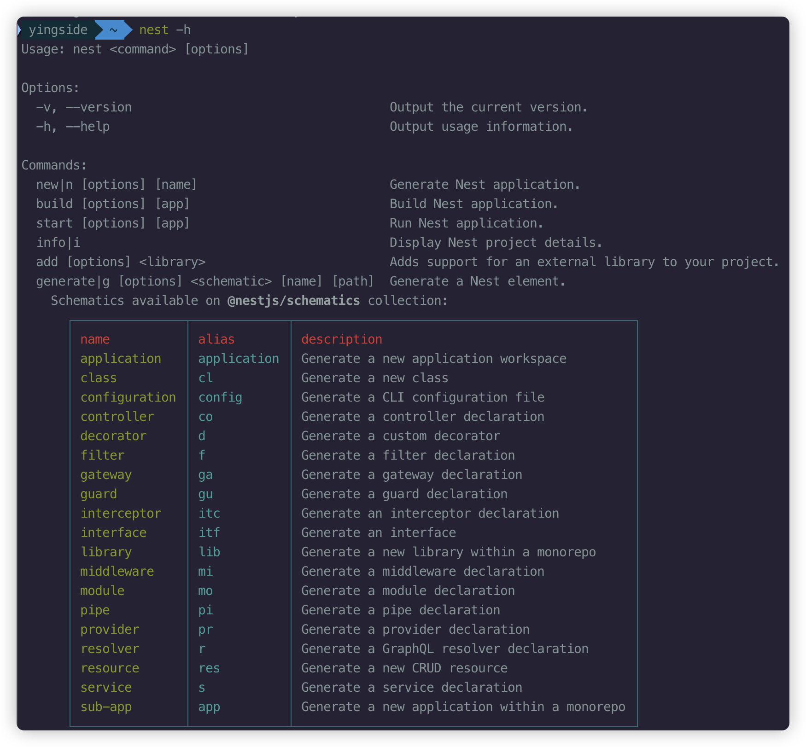

上图展示了 `nest -h` 的输出：命令名称右侧会显示别名，例如 `new|n` 和 `generate|g`；下方还会列出控制器、模块、服务、资源等可生成类型。

如果不希望全局安装 CLI，也可以在已经安装 `@nestjs/cli` 的项目中使用：

```bash
npx nest --help
```

`--help` 可以简写为 `-h`，也可以放在具体命令后查看该命令的参数，例如：

```bash
nest new -h
nest generate -h
nest build -h
```

预期效果：终端显示 Nest CLI 的版本号或帮助信息，说明 CLI 可以正常使用。

## 使用 CLI 创建 Nest 项目
`nest new` 会创建基础目录和配置文件、安装依赖，并默认初始化 Git 仓库。

在准备存放项目的目录中执行：

```bash
nest new cli-test
```

CLI 会询问使用哪一种包管理器。也可以直接传入参数，减少交互步骤：

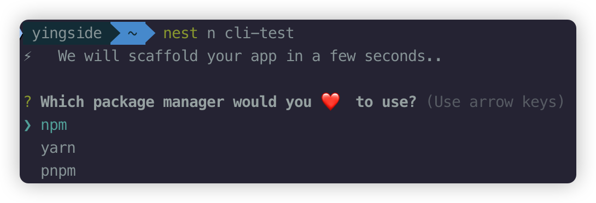

上图是未指定 `--package-manager` 时出现的选择界面，使用方向键选择后按回车确认。

```bash
nest new cli-test --package-manager pnpm --language TS --strict
```

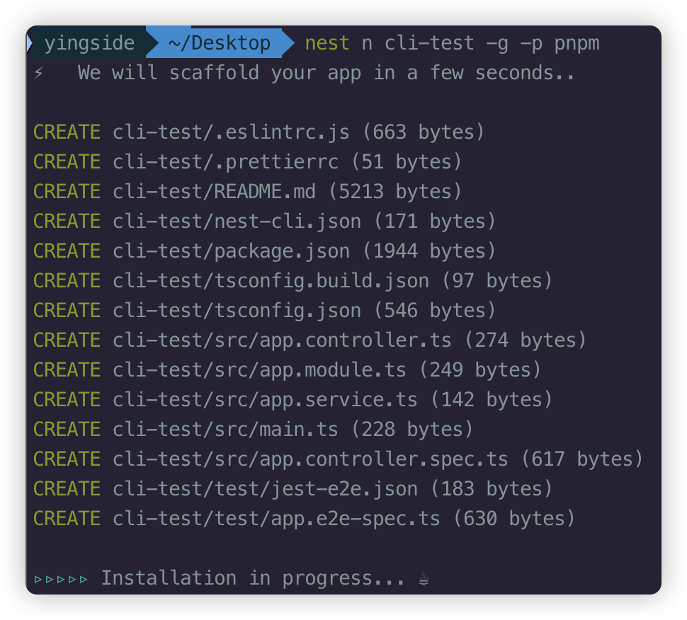

上图中的短参数 `-g` 表示跳过 Git 初始化，`-p pnpm` 表示使用 pnpm。终端先列出创建的文件，再进入依赖安装阶段。

常用选项：

- `--package-manager`：指定 `npm`、`yarn` 或 `pnpm`。
- `--language`：指定 `TS` 或 `JS`，默认使用 TypeScript。
- `--strict`：启用 TypeScript 严格模式。
- `--skip-git`：跳过 Git 仓库初始化。
- `--skip-install`：只生成项目文件，不安装依赖。
- `--collection`：指定代码生成器集合，通常保留默认值 `@nestjs/schematics`。

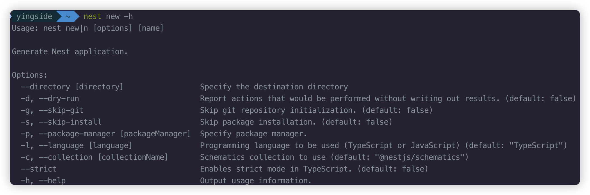

上图说明 `nest new` 可以设置目标目录、包管理器、编程语言、严格模式，也可以跳过 Git 初始化或依赖安装。

查看全部选项：

```bash
nest new --help
```

如果使用了 `--skip-install`，需要进入项目并手动安装依赖：

```bash
cd cli-test
pnpm install
```

包管理器应与锁文件保持一致。本章 Demo 包含 `pnpm-lock.yaml`，因此后续命令使用 `pnpm`。

预期效果：当前目录下出现 `cli-test` 文件夹，其中包含 `src`、`test`、`package.json`、`tsconfig.json` 和 `nest-cli.json` 等内容。

## 认识 CLI 项目结构与启动流程
本章 Demo 的主要结构如下：

```text
cli-test/
├─ src/
│  ├─ main.ts                 # 应用入口
│  ├─ app.module.ts           # 根模块
│  ├─ app.controller.ts       # 接收并处理 HTTP 请求
│  ├─ app.service.ts          # 编写业务逻辑
│  ├─ admin.entity.ts         # 描述管理员数据
│  ├─ user/                   # generate 命令生成的功能目录
│  └─ person/                 # resource 命令生成的 CRUD 目录
├─ test/                      # 端到端测试
├─ nest-cli.json              # Nest CLI 配置
├─ package.json               # 依赖与脚本
└─ tsconfig.json              # TypeScript 配置
```

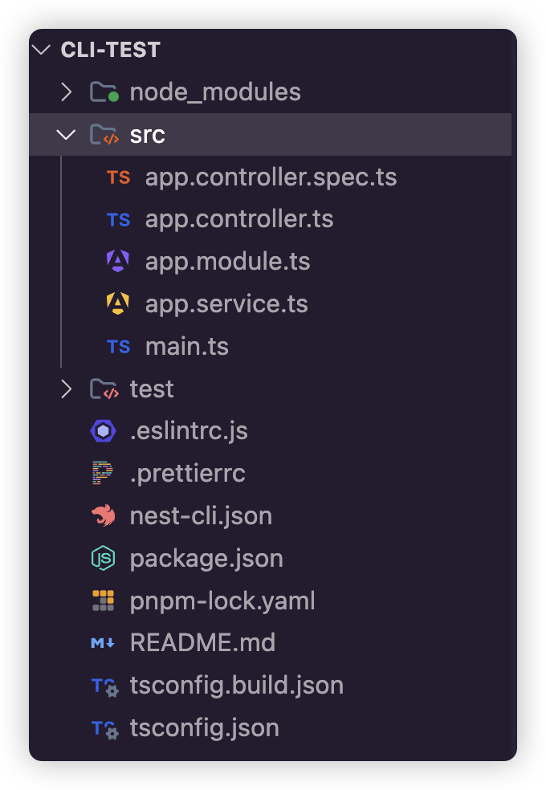

上图直观展示了项目初始结构：业务源码位于 `src`，测试位于 `test`，项目根目录保存 CLI、TypeScript、ESLint、Prettier 和包管理配置。

应用从 `src/main.ts` 开始运行：

```typescript
import { NestFactory } from '@nestjs/core';
import { AppModule } from './app.module';

async function bootstrap() {
  const app = await NestFactory.create(AppModule);
  await app.listen(process.env.PORT ?? 3000);
}

bootstrap();
```

`NestFactory.create(AppModule)` 以根模块为入口创建应用。`process.env.PORT ?? 3000` 表示优先使用环境变量 `PORT`，没有设置时监听 `3000` 端口。

本章 Demo 的根模块为：

```typescript
import { Module } from '@nestjs/common';
import { AppController } from './app.controller';
import { AppService } from './app.service';
import { UserModule } from './user/user.module';
import { PersonModule } from './person/person.module';

@Module({
  imports: [UserModule, PersonModule],
  controllers: [AppController],
  providers: [AppService],
})
export class AppModule {}
```

- `imports` 注册其他功能模块。
- `controllers` 注册负责接收 HTTP 请求的控制器。
- `providers` 注册可被依赖注入的服务。

预期效果：启动项目后，访问 `http://localhost:3000` 下已定义的路由时，请求会进入对应控制器。

## 使用 generate 生成模块、控制器和服务
`nest generate` 会根据官方模板创建代码。先查看支持生成的内容：

```bash
nest generate --help
```

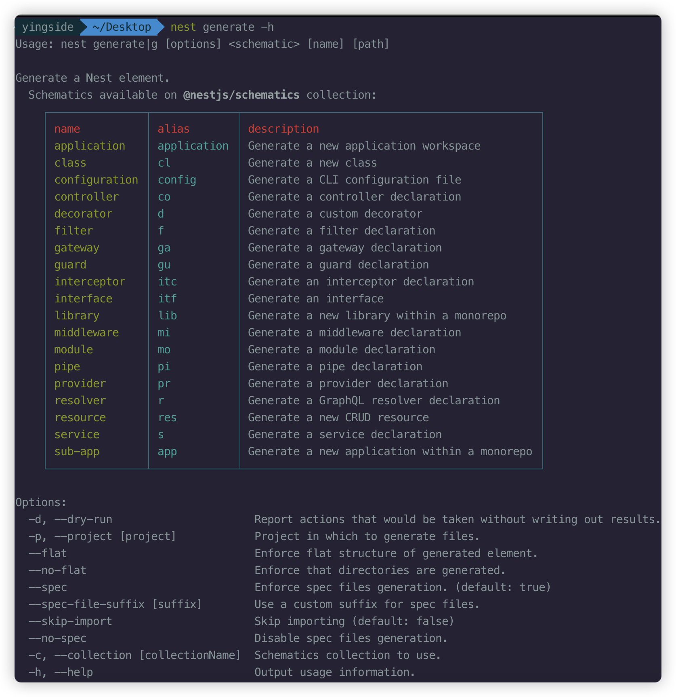

帮助信息会列出每种代码类型的名称和别名，例如 `controller` 的别名是 `co`、`module` 的别名是 `mo`、`service` 的别名是 `s`。下方的 `--no-spec` 可以禁止生成测试文件。

以 `user` 功能为例，进入 `cli-test` 项目根目录后依次执行：

```bash
nest generate module user
nest generate controller user
nest generate service user
```

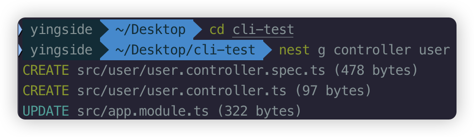

控制器命令创建 `user.controller.ts` 及其测试文件，并自动更新父模块中的注册信息。

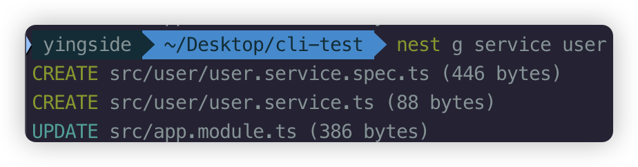

服务命令创建 `user.service.ts` 及其测试文件，并把服务注册到模块的 `providers` 中。

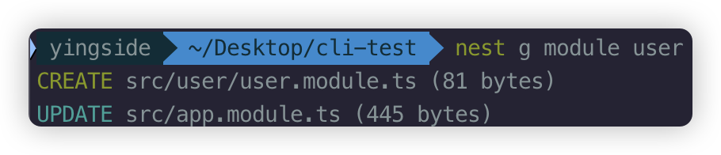

模块命令创建 `user.module.ts`，并把 `UserModule` 加入根模块。实际操作时通常先生成模块，再生成该模块中的控制器和服务，结构更清晰。

也可以使用别名：

```bash
nest g mo user
nest g co user
nest g s user
```

本章 Demo 在生成的文件中加入了一个查询用户列表的功能。服务负责准备数据：

```typescript
// src/user/user.service.ts
import { Injectable } from '@nestjs/common';

@Injectable()
export class UserService {
  getUserList() {
    return [
      { id: 1, name: 'jack', age: 19 },
      { id: 2, name: 'rose', age: 17 },
    ];
  }
}
```

控制器负责定义请求地址：

```typescript
// src/user/user.controller.ts
import { Controller, Get } from '@nestjs/common';
import { UserService } from './user.service';

@Controller('user')
export class UserController {
  constructor(private readonly userService: UserService) {}

  @Get('list')
  getUserList() {
    return this.userService.getUserList();
  }
}
```

模块把控制器和服务组合在一起：

```typescript
// src/user/user.module.ts
import { Module } from '@nestjs/common';
import { UserController } from './user.controller';
import { UserService } from './user.service';

@Module({
  controllers: [UserController],
  providers: [UserService],
})
export class UserModule {}
```

控制器收到 `GET /user/list` 请求后，调用通过构造函数注入的 `UserService`。生成模块时，CLI 通常会自动将模块加入最近的父模块，但仍应检查 `AppModule` 的 `imports` 是否包含 `UserModule`。

启动项目并验证：

```bash
pnpm run start:dev
curl http://localhost:3000/user/list
```

预期效果：接口返回两条用户数据组成的 JSON 数组。

## 使用 resource 生成 CRUD 模板
模块、控制器和服务可以逐个生成，也可以使用 `resource` 一次生成一套 CRUD 模板：

```bash
nest generate resource person
```

执行后按提示选择：

1. 传输层选择 `REST API`。
2. 是否生成 CRUD 入口选择 `Yes`。

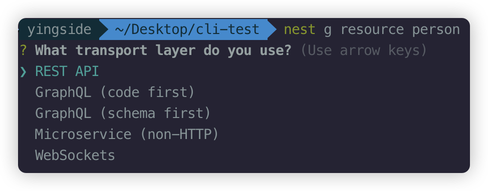

本章需要生成普通 HTTP 接口，因此在传输层列表中选择 `REST API`。

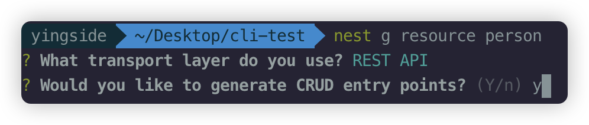

第二个问题询问是否生成完整 CRUD 入口，输入 `y` 或选择 `Yes`。

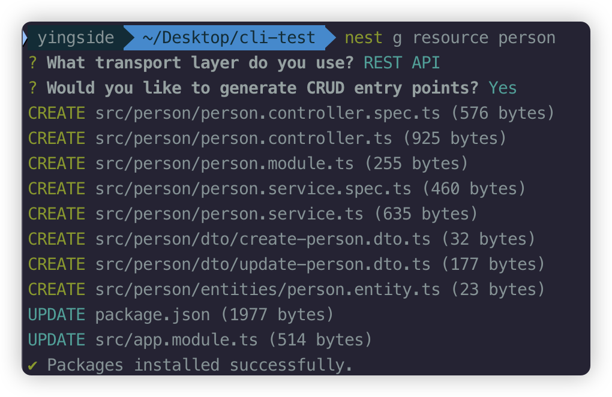

确认后，CLI 会一次创建控制器、模块、服务、DTO、Entity 和测试文件，还会更新 `package.json` 与 `app.module.ts`。

如果不需要 `.spec.ts` 单元测试文件，可以添加 `--no-spec`：

```bash
nest g resource person --no-spec
```

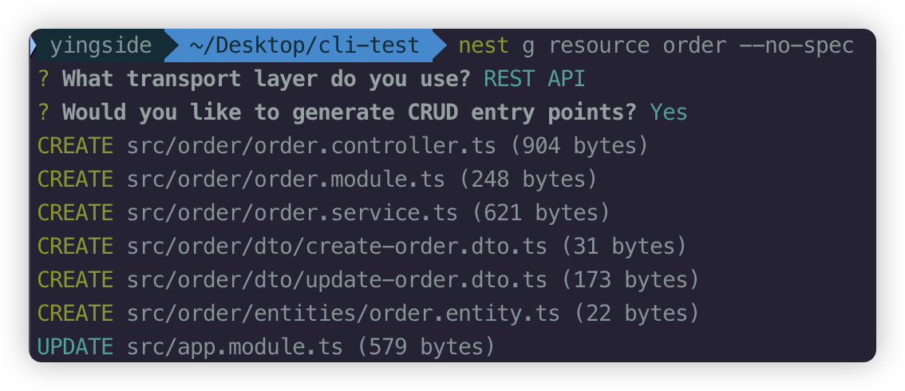

上图用 `order` 资源验证了 `--no-spec`：生成列表中只有业务文件，没有 `controller.spec.ts` 和 `service.spec.ts`。

生成结果通常为：

```text
src/person/
├─ dto/
│  ├─ create-person.dto.ts
│  └─ update-person.dto.ts
├─ entities/
│  └─ person.entity.ts
├─ person.controller.ts
├─ person.service.ts
└─ person.module.ts
```

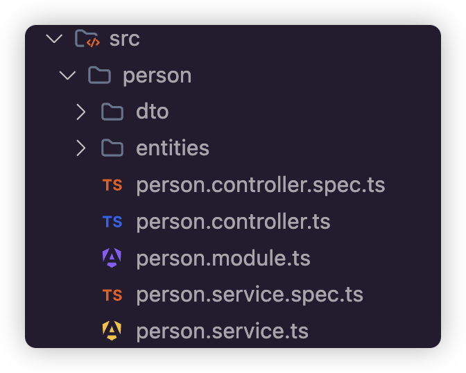

上图展示未使用 `--no-spec` 时的目录，因此控制器和服务旁边各有一个 `.spec.ts` 测试文件。

本章 Demo 的控制器包含以下 REST 操作：

```typescript
@Post()
create(@Body() createPersonDto: CreatePersonDto) {
  return this.personService.create(createPersonDto);
}

@Get('list')
findAll() {
  return this.personService.findAll();
}

@Get('get/:id')
findOne(@Param('id') id: string) {
  return this.personService.findOne(+id);
}

@Patch(':id')
update(@Param('id') id: string, @Body() updatePersonDto: UpdatePersonDto) {
  return this.personService.update(+id, updatePersonDto);
}

@Delete(':id')
remove(@Param('id') id: string) {
  return this.personService.remove(+id);
}
```

- DTO 用于描述请求数据的结构。
- Entity 用于描述业务实体。
- `@Body()` 读取请求体，`@Param('id')` 读取路径参数。
- `+id` 把字符串形式的路径参数转换为数字。
- `UpdatePersonDto` 使用 `PartialType(CreatePersonDto)`，表示更新时各字段可以是可选的。
- 初始生成的 Service 只返回演示文本，不会自动连接数据库。

启动项目后可以分别验证：

```bash
curl -X POST http://localhost:3000/person
curl http://localhost:3000/person/list
curl http://localhost:3000/person/get/1
curl -X PATCH http://localhost:3000/person/1
curl -X DELETE http://localhost:3000/person/1
```

预期效果：各接口返回生成模板中的提示文本。当前 DTO 为空，因此这一步只用于理解路由结构，不代表已经完成真实的增删改查功能。

## 配置 nest-cli.json
`nest-cli.json` 用于保存经常使用的生成和编译选项，避免每次执行命令时重复传参。本章 Demo 的配置如下：

```json
{
  "$schema": "https://json.schemastore.org/nest-cli",
  "collection": "@nestjs/schematics",
  "sourceRoot": "src",
  "compilerOptions": {
    "deleteOutDir": true,
    "webpack": true
  },
  "generateOptions": {
    "spec": false,
    "flat": false
  }
}
```

- `$schema`：为编辑器提供配置提示和校验。
- `collection`：指定生成代码时使用的模板集合。
- `sourceRoot`：指定源码根目录。
- `deleteOutDir`：构建前清空旧输出目录，避免残留文件。
- `webpack`：默认使用 webpack 构建。
- `generateOptions.spec`：设为 `false` 后，默认不生成 `.spec.ts` 测试文件。
- `generateOptions.flat`：设为 `false` 后，为生成内容创建独立目录。

修改配置后可以验证生成行为：

```bash
nest g controller product
```

预期效果：生成 `src/product/product.controller.ts`，但不会同时生成 `product.controller.spec.ts`。

注意：`nest-cli.json` 是严格 JSON，不能直接加入 `// 注释`，否则可能导致解析失败。

## 构建与运行应用
在 `cli-test` 项目根目录启动开发模式：

```bash
nest start --watch
```

`--watch` 可以简写为 `-w`。源码变化后，应用会自动重新编译并重启。本章 Demo 的 `package.json` 已提供等价脚本：

```bash
pnpm run start:dev
```

普通构建：

```bash
nest build
```

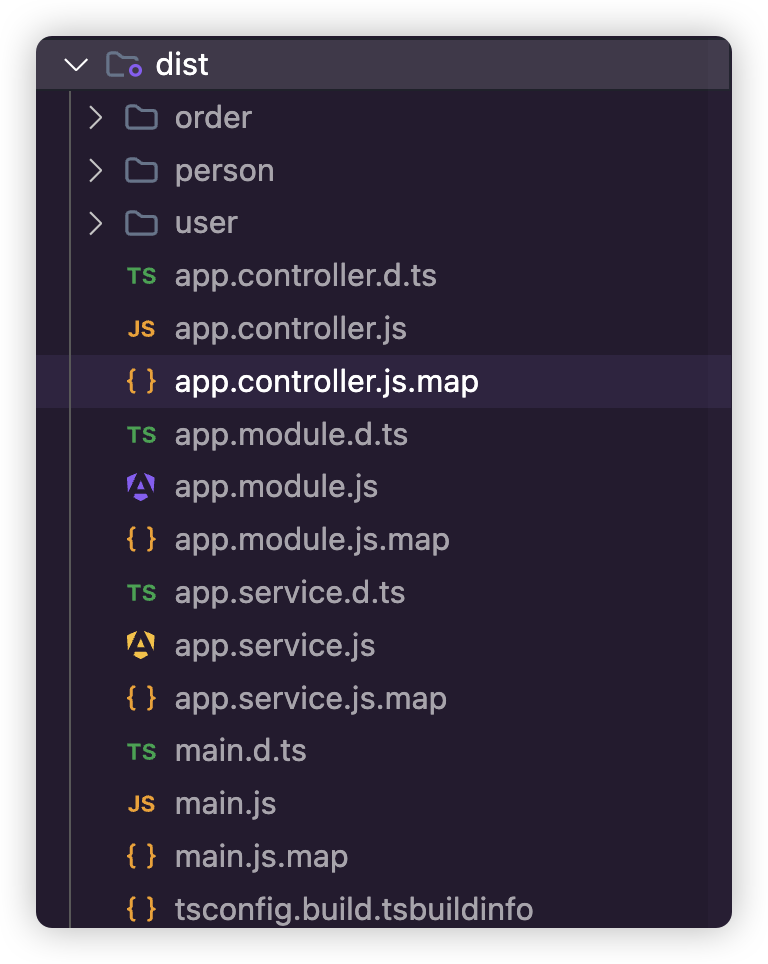

普通 TypeScript 构建会保留源码目录结构，并生成 `.js`、`.d.ts` 和 `.js.map` 等文件。

显式使用 webpack 构建：

```bash
nest build --builder webpack
```


webpack 会把应用依赖打包到入口产物中，因此截图中的 `dist` 目录主要显示一个 `main.js`。

也可以通过 `nest-cli.json` 中的 `"webpack": true` 将 webpack 设为默认构建方式。构建成功后运行生产代码：

```bash
pnpm run start:prod
```

- 默认构建输出位于 `dist` 目录。
- `start:prod` 实际执行 `node dist/main`，因此运行前必须先完成构建。
- `nest build` 只负责编译或打包，不会启动 HTTP 服务。

预期效果：构建成功后出现 `dist` 目录；运行生产脚本后，应用开始监听配置的端口。

## 编写并测试第一个接口
本章 Demo 使用实体、服务和控制器完成一个最小查询接口。

实体用于描述返回数据：

```typescript
// src/admin.entity.ts
export class Admin {
  constructor(
    private id: string,
    private name: string,
    private password: string,
  ) {
    this.id = id;
    this.name = name;
    this.password = password;
  }
}
```

服务负责准备管理员数据：

```typescript
// src/app.service.ts
import { Injectable } from '@nestjs/common';
import { Admin } from './admin.entity';

@Injectable()
export class AppService {
  getAdminList() {
    const adminList: Admin[] = [
      new Admin('1', 'jack', '123456'),
      new Admin('2', 'rose', '123456'),
    ];
    return adminList;
  }
}
```

控制器定义访问路径并调用服务：

```typescript
// src/app.controller.ts
import { Controller, Get } from '@nestjs/common';
import { AppService } from './app.service';

@Controller('app')
export class AppController {
  constructor(private readonly appService: AppService) {}

  @Get('list')
  getAdminList() {
    return this.appService.getAdminList();
  }
}
```

启动并测试接口：

```bash
pnpm run start:dev
curl http://localhost:3000/app/list
```

- `@Controller('app')` 定义控制器公共路径 `/app`。
- `@Get('list')` 定义 GET 子路径 `/list`，组合后的地址是 `/app/list`。
- Nest 会把方法返回的数组自动序列化为 JSON。
- TypeScript 的 `private` 只提供编译期访问限制，并不会自动从 JSON 中隐藏字段。

预期效果：客户端收到包含两条管理员数据的 JSON 数组。

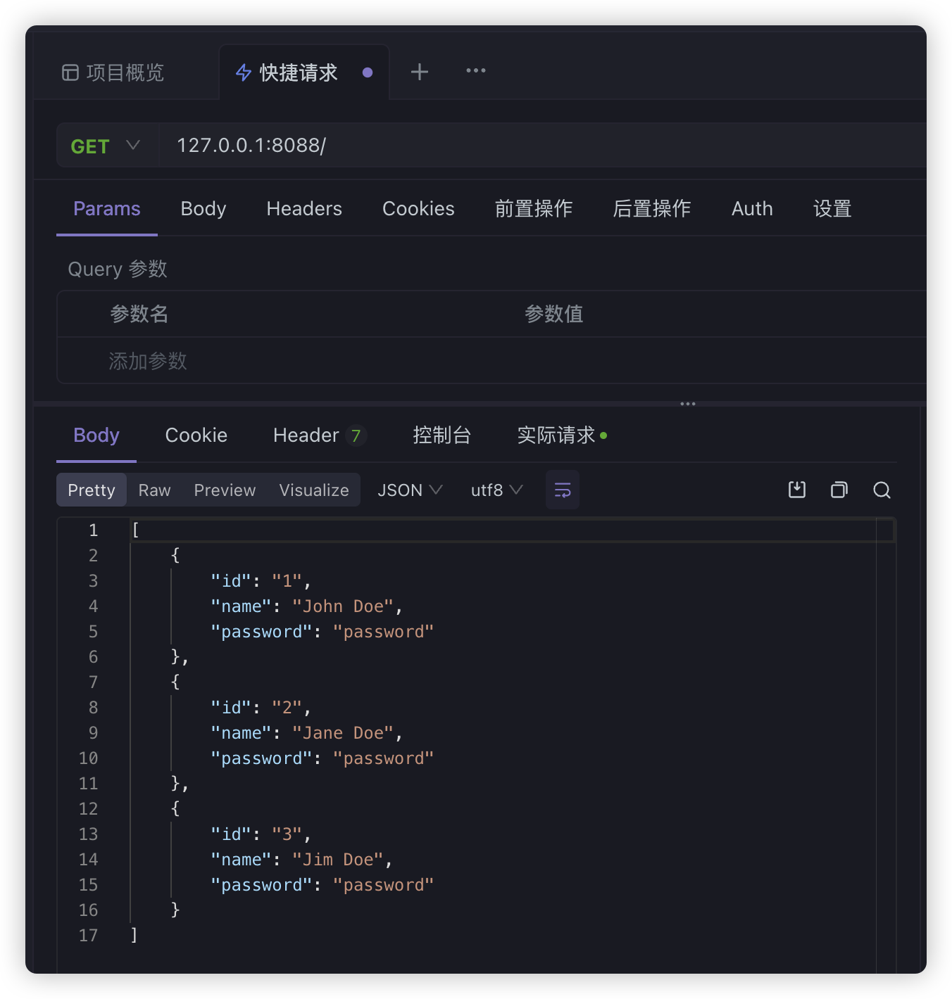

上图展示了把监听端口改为 `8088` 后的测试结果：GET 请求成功返回 JSON 数组，每一项都包含 `id`、`name` 和 `password`。

本例中的明文密码只用于展示返回对象。真实项目禁止明文保存密码，也不应通过接口返回密码字段。如果把 `main.ts` 的监听端口改为 `8088`，测试地址也要改为 `http://localhost:8088/app/list`。

## 处理 ESLint 与 Prettier 格式提示
CLI 项目默认集成 ESLint 和 Prettier。编辑器中的波浪线不一定表示 TypeScript 无法编译，也可能只是代码格式不符合规则。应先阅读具体提示，再决定修正代码还是调整规则。

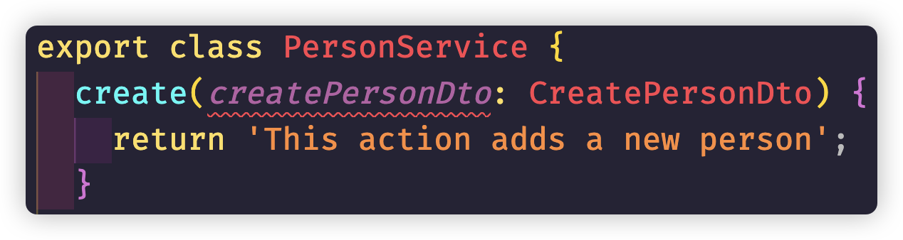

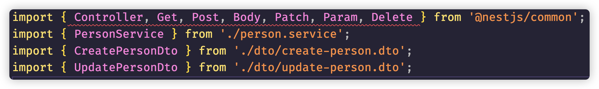

这两张图中的波浪线集中在生成代码的参数和格式位置。它们可能来自未使用参数或 Prettier 格式规则，应以编辑器诊断信息和 `pnpm run lint` 的结果为准，不能只凭波浪线判断应用无法运行。

自动格式化并检查代码：

```bash
pnpm run format
pnpm run lint
```

本章 Demo 在 `.eslintrc.js` 中关闭了部分 TypeScript 规则，并兼容不同系统的换行符：

```javascript
module.exports = {
  // 其余配置保持不变
  rules: {
    '@typescript-eslint/interface-name-prefix': 'off',
    '@typescript-eslint/explicit-function-return-type': 'off',
    '@typescript-eslint/explicit-module-boundary-types': 'off',
    '@typescript-eslint/no-explicit-any': 'off',
    '@typescript-eslint/no-unused-vars': 'off',
    'prettier/prettier': [
      'warn',
      {
        endOfLine: 'auto',
      },
    ],
  },
};
```

- `off` 表示关闭对应检查，`warn` 表示只给出警告。
- `endOfLine: 'auto'` 让 Prettier 接受当前系统的换行风格。
- 关闭规则会减少约束，不代表代码质量自动提高。生产项目应优先删除无用变量并补充准确类型。
- 规则名称取决于 ESLint 和 `@typescript-eslint` 的版本；升级依赖后应根据终端提示处理已废弃规则。

预期效果：重新运行格式化和检查命令后，符合当前配置的格式提示消失，真正的语法错误和类型错误仍会保留。
