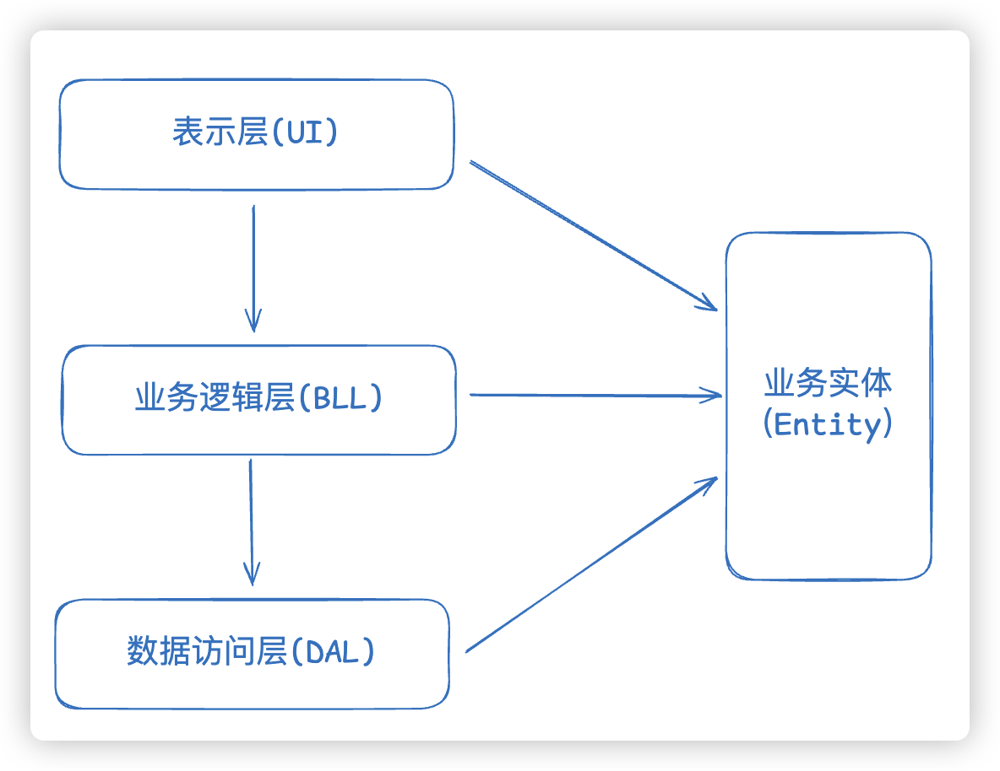
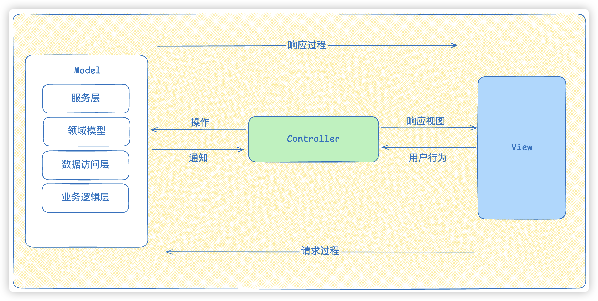
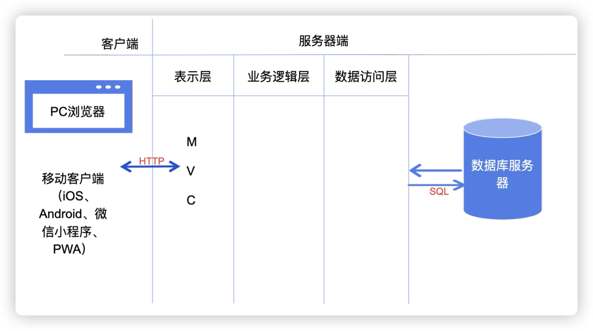

# 03.三层架构与MVC

1. 三层架构
2. MVC
3. 三层架构与MVC的区别

## 三层架构

### 三层架构是什么？

三层架构（Three-Tier Architecture）是一种常见的软件架构模式，它将应用程序划分为三个逻辑层——**表示层（Presentation Layer）**、**业务逻辑层（Business Logic Layer）** 和**数据访问层（Data Access Layer）**。它的核心目的是实现"高内聚、低耦合"，让系统更容易维护、扩展和复用。

### 三个层次

1. **表示层（Presentation Layer）**——负责与用户交互，展示数据并接收用户输入，通常包括用户界面（UI）和交互逻辑。

2. **业务逻辑层（Business Logic Layer）**——处理核心业务逻辑，执行具体的业务规则。它将表示层的输入转化为对数据的操作，再把结果返回给表示层。这一层的关键职责是保证数据的完整性和一致性，也是整个系统的核心所在。

3. **数据访问层（Data Access Layer）**——负责与数据库交互，执行 CRUD 操作（创建、读取、更新、删除）。它为上层提供数据存取接口，屏蔽掉具体数据库的实现细节。

*上图展示了三层架构中请求和数据的流动方向：表示层发起请求 → 业务逻辑层处理 → 数据访问层存取数据，然后逆向返回结果。*

### Entity（实体层）

它不属于三层中的任何一层，但却是必不可少的一层。每一层（表示层 → 业务逻辑层 → 数据访问层）之间的数据传递，是靠变量或实体作为参数来完成的。可以把实体理解成"数据容器"。

对于初学者，可以这样理解：后端最终是和数据库打交道，每张数据表对应一个实体，表中的每个字段对应实体的属性。

**注意**：这只是一种简化理解。实际开发中：
- 实体不一定和数据库字段一一对应，比如密码验证时的"再次输入密码"字段在数据库中就不存在
- 数据库中的字段也不一定要映射为实体属性，比如"删除标记"（用 0/1 表示是否删除）可能只在查询时使用，而不作为实体属性暴露

### 三层架构的优点

1. **分离关注点**：每一层只关注自己的职责，代码逻辑清晰。
2. **可维护性高**：修改某一层的代码不会影响其他层。
3. **可复用性高**：业务逻辑和数据访问层可以在不同的表示层中复用。

**通俗类比**：餐厅里的三个角色各司其职——**服务员**只管接待客人，**厨师**只管做菜，**采购员**只管采购食材。服务员不用知道菜怎么做，厨师不用知道菜从哪里买，采购员不用知道客人是谁。服务员请假就另找服务员，厨师不行就换厨师，任何一层变动都不会影响其他层。

---

## MVC

### MVC 是什么？

MVC（Model-View-Controller）是一种广泛应用的软件架构模式，用于组织代码结构。它将应用程序分为三个主要部分：**模型（Model）**、**视图（View）** 和**控制器（Controller）**，目标是**将业务逻辑与用户界面分离**，提高代码的可维护性和可扩展性。

### 三个组件

1. **模型（Model）**——代表数据或业务逻辑，负责数据的获取、存储、验证以及数据库操作。它不关心视图和控制器如何交互，只专注于数据和业务规则。

2. **视图（View）**——负责展示数据，也就是用户界面。它从模型中获取数据并展示给用户，不直接处理业务逻辑。在传统服务端渲染中，视图可能是 JSP、Thymeleaf、FreeMarker 等模板引擎；在前后端分离的体系中，通常指客户端框架（Vue、React、Angular 等）负责的部分。

3. **控制器（Controller）**——负责处理用户输入、调度 Service 以及管理 API 路由。它接收用户请求，调用相应的模型处理数据，然后将结果传递给视图展示。控制器起到"调度员"的作用，协调模型和视图的交互。

### MVC 的请求流程

当一个 HTTP 请求到达服务器时，执行过程如下：

1. 请求首先被 **Controller** 接收
2. Controller 调用 **Model** 层中相应的模块处理业务逻辑
3. 处理结果返回给 **View** 层进行展示

### MVC 的优点

1. **分离关注点**：数据处理、用户界面和控制逻辑分开，减少耦合。
2. **提高可维护性**：每个组件独立，修改和扩展更方便。
3. **易于扩展和复用**：视图和模型可以独立发展，Controller 协调不同组件。
4. **支持多视图**：同一个模型可以有多个视图（如 Web 界面和移动端界面），无需重复业务逻辑。

---

## 三层架构与 MVC 的区别

虽然三层架构和 MVC 都强调"分层"和"职责分离"，但它们的**关注点、应用范围和目的**不同。你觉得它们相似，是因为它们都追求"分离关注点"，但切分方式完全不同。

### 1. 关注点不同

| 三层架构 | MVC |
|---------|-----|
| 关注**应用程序的逻辑分层**，偏向**后端逻辑组织** | 关注**前端展示和交互的分层**，偏向**用户界面与业务逻辑的交互** |
| 面向整个系统，特别是后端开发 | 面向前端与后端交互部分 |

### 2. 层次划分不同

**三层架构的层次**：
- 表示层（UI 层）——提供用户界面，展示数据，接收用户输入
- 业务逻辑层（BLL）——处理业务规则，是系统的核心
- 数据访问层（DAL）——与数据库交互，负责数据存取

**MVC 的层次**：
- 模型（Model）——处理数据和业务逻辑
- 视图（View）——展示数据
- 控制器（Controller）——接收请求，调用模型，更新视图

**关键区别**：
- 三层架构的**层次划分更偏向后端服务分层**，关注"请求 → 业务逻辑 → 数据库"这条线
- MVC 的**层次划分更偏向于前端与后端交互部分**，关注"用户界面与业务逻辑的解耦"

### 3. 应用范围不同

| 三层架构 | MVC |
|---------|-----|
| 常用于**整个应用系统的架构设计**，包括后端和数据库 | 常用于**前端框架或 Web 应用的界面交互层设计** |
| 更适合大型企业系统，需要清晰的业务逻辑层和数据访问层 | 更适合前端开发和 Web 开发中的 UI 分层设计 |

### 4. 结合使用

三层架构和 MVC 并不是互斥的，它们可以**结合使用**，共同构建完整的应用体系：

- **表示层（UI 层）**内部可以采用 **MVC 模式**，将前端代码组织为视图、模型和控制器
- **业务逻辑层**和**数据访问层**则采用传统的**三层架构**模式，处理核心业务和数据存储

举个例子：在一个 NestJS 项目中，Controller 属于 MVC 的 C（控制器），同时也属于三层架构中的表示层；Service 属于三层架构中的业务逻辑层；而 Repository/DAO 则属于数据访问层。这就体现了两种模式的融合。