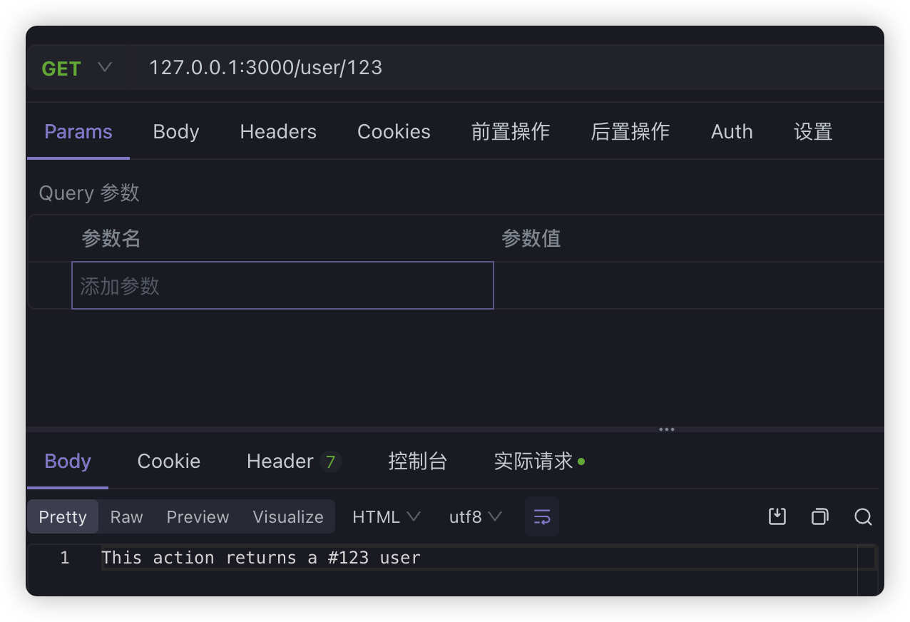
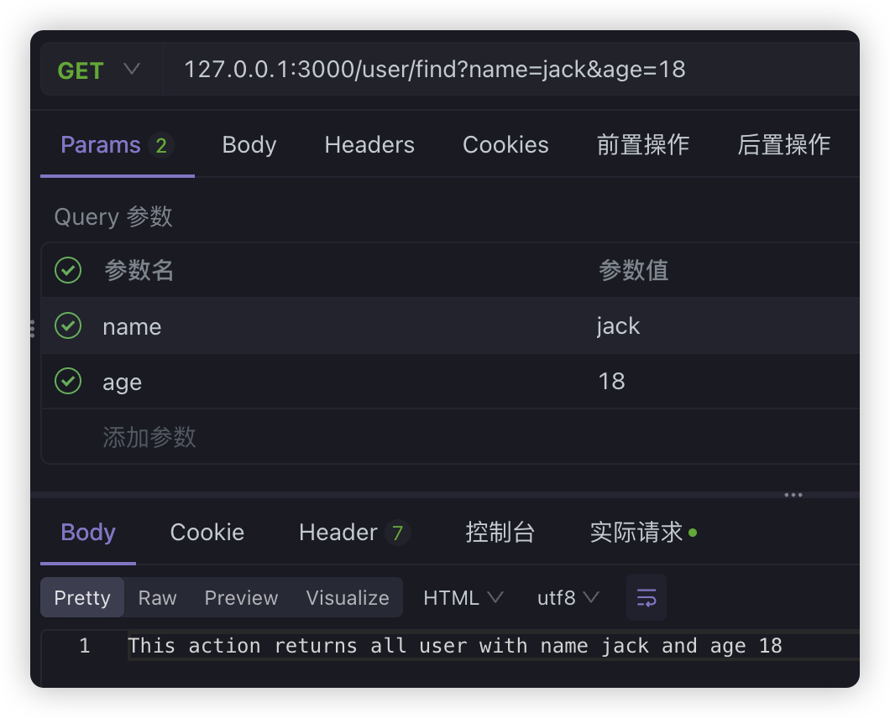
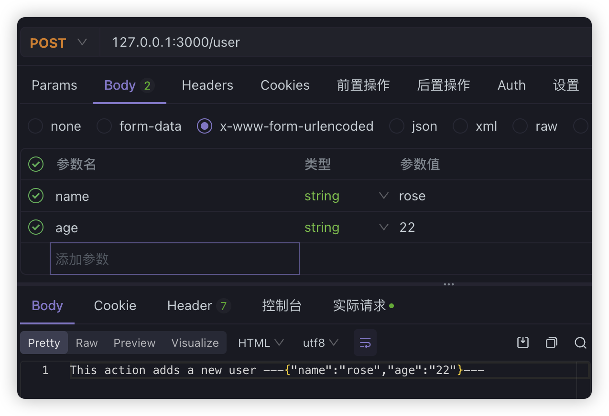
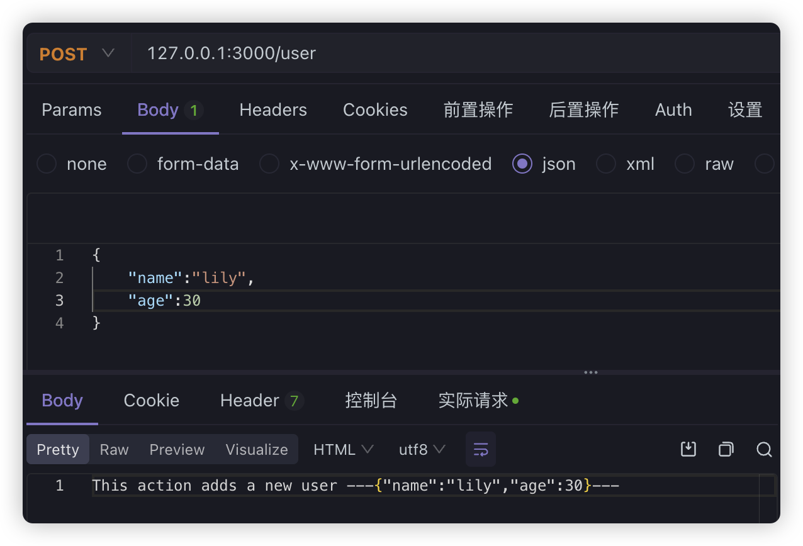
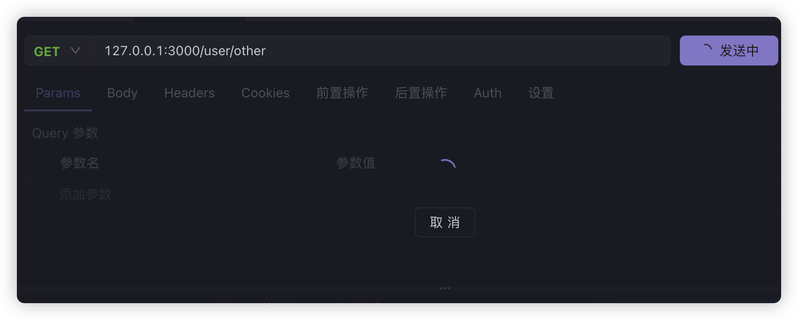

# 6.Nest中的装饰器
1. 认识装饰器
2. Nest 中的常用装饰器
3. HTTP 数据传输的 5 种方式
4. 用 @Param 和 @Query 接收 GET 请求参数
5. 用 @Body 接收请求体数据（form-urlencoded 与 JSON）
6. 其他参数装饰器：@Ip、@Headers、@Req
7. 使用 @Res 手动处理响应

## 认识装饰器

装饰器（Decorator）是 TypeScript 提供的一种"给代码贴标签"的写法：以 `@` 开头，紧跟一个名字，写在类、方法、属性或参数前面，用来给目标附加标记、补充行为，或者让框架能识别出它。Nest 就是靠装饰器来"看懂"你的代码该做路由、该做注入、该做什么拦截的。

TypeScript 中常见的装饰器一共有 5 种：

- **类装饰器**：装饰整个类
- **方法装饰器**：装饰类里的方法
- **属性装饰器**：装饰类的属性
- **参数装饰器**：装饰方法的参数
- **访问器装饰器**：装饰 `get`/`set` 访问器（不常用）

Nest 在框架内部用到了前 4 种，对应关系如下：

| 装饰器类型 | 常见例子 |
| --- | --- |
| 类装饰器 | `@Controller`、`@Injectable`、`@Module`、`@UseInterceptors` |
| 方法装饰器 | `@Get`、`@Post`、`@Patch`、`@Delete`、`@UseInterceptors` |
| 属性装饰器 | `@IsNotEmpty`、`@IsString`、`@IsNumber` |
| 参数装饰器 | `@Body`、`@Param`、`@Query` |

常用装饰器远不止这些，这里只列出最常用的一部分，其余的在后面课程中会陆续遇到。

## Nest 中的常用装饰器

逐个说明最常用的几个装饰器的用途：

- `@Controller()`：装饰控制器类，让这个类能管理路由。可以传入字符串作为路径前缀，把一类路由统一挂到同一个路径下，实现路由的模块化管理。例如 `@Controller('user')` 表示该类里所有路由都挂在 `/user` 下。
- `@Injectable()`：装饰类后，这个类就成为一个服务提供者（provider），可以被 Nest 容器管理，并注入到其他对象中使用（依赖注入）。通常搭配 `@Module` 的 `providers` 一起使用。
- `@Module()`：模块装饰器，用来划分功能模块，并限制依赖注入的范围。模块内声明的 provider 只在本模块及导入它的模块中可见。
- `@UseInterceptors()`：绑定拦截器，既可以写在类上，也可以写在方法上。它是 AOP 类装饰器的一种，类似的还有 `@UseFilters()`（过滤器）、`@UsePipes()`（管道）等，写法都差不多。
- `@Global()`：声明一个全局模块，让它的 provider 在整个应用里都可以注入。
- HTTP 方法装饰器：`@Get`、`@Post`、`@Put`、`@Delete`、`@Patch`、`@Options`、`@Head`，分别把方法注册成对应请求方式的接口。

下面用课堂 Demo 里 `nest g resource` 生成的 `person` 模块，把这几种装饰器串起来看：

```typescript
// src/person/person.controller.ts
import { Controller, Get, Post, Body, Patch, Param, Delete } from '@nestjs/common';
import { PersonService } from './person.service';
import { CreatePersonDto } from './dto/create-person.dto';
import { UpdatePersonDto } from './dto/update-person.dto';

@Controller('person') // 类装饰器：路径前缀为 /person
export class PersonController {
  constructor(private readonly personService: PersonService) {}

  @Post() // 方法装饰器：POST /person
  create(@Body() createPersonDto: CreatePersonDto) {
    return this.personService.create(createPersonDto);
  }

  @Get('list') // 方法装饰器：GET /person/list
  findAll() {
    return this.personService.findAll();
  }

  @Get('get/:id') // 方法装饰器：GET /person/get/:id
  findOne(@Param('id') id: string) {
    return this.personService.findOne(+id);
  }

  @Patch(':id') // 方法装饰器：PATCH /person/:id
  update(@Param('id') id: string, @Body() updatePersonDto: UpdatePersonDto) {
    return this.personService.update(+id, updatePersonDto);
  }

  @Delete(':id') // 方法装饰器：DELETE /person/:id
  remove(@Param('id') id: string) {
    return this.personService.remove(+id);
  }
}
```

`@Controller('person')` 是类装饰器，`@Get`、`@Post`、`@Patch`、`@Delete` 是方法装饰器，`@Param`、`@Body` 是参数装饰器。方法装饰器括号里写的是路由路径片段（`:id` 是路径参数占位符），接口的完整路径 = 控制器前缀 + 该片段；括号里不写（如 `@Post()`）时片段为空，接口就挂在控制器根路径下（如 `POST /person`）。

对应的模块文件把控制器和服务提供者注册进模块：

```typescript
// src/person/person.module.ts
import { Module } from '@nestjs/common';
import { PersonService } from './person.service';
import { PersonController } from './person.controller';

@Module({
  controllers: [PersonController],
  providers: [PersonService], // PersonService 有 @Injectable() 装饰
})
export class PersonModule {}
```

> 提示：`@Module`、`@Controller`、`@Injectable` 这些装饰器的运行前提是 TS 开启了装饰器支持。Nest 项目的 `tsconfig.json` 默认已经打开了 `experimentalDecorators: true` 和 `emitDecoratorMetadata: true`，无需手动配置。

## HTTP 数据传输的 5 种方式

对于后端来说，主要工作就是提供 HTTP 接口来传输数据。数据从前端传到后端，常见的有 5 种方式：

1. **url param**：把参数直接写在 URL 路径里，例如 `http://127.0.0.1:3000/person/123`，`123` 就是路径参数。
2. **query**：通过 URL 中 `?` 后面的、用 `&` 分隔的键值对传参，例如 `http://127.0.0.1:3000/person?name=jack&age=19`。
3. **form-urlencoded**：用表单提交数据，`Content-Type` 为 `application/x-www-form-urlencoded`，数据放在请求体里。
4. **json**：传输 JSON 数据，`Content-Type` 为 `application/json`，数据放在请求体里。
5. **form-data**：主要用于传文件，需要指定 `Content-Type` 为 `multipart/form-data`，并用 `boundary` 分割线区分多段数据。

其中 **url param 和 query 本质上都是 GET 请求**，只是 URL 的处理方式不同；form-urlencoded 和 json 都是 POST 请求，数据都在请求体里。form-data 涉及文件上传，本 Demo 暂不展开，后面章节会专门用例子讲解。

## 用 @Param 和 @Query 接收 GET 请求参数

Demo 里的 `UserController` 同时演示了 `@Query`、`@Param`、`@Body`、`@Ip`、`@Headers`、`@Req`、`@Res` 等参数装饰器的用法，先看接收 GET 参数的部分。

> 前置步骤：进入 Demo 项目根目录 `06.Nest中的装饰器/代码/cli-test`，安装依赖后执行 `npm run start:dev`（或使用 pnpm 执行 `pnpm start:dev`），项目启动在 `http://127.0.0.1:3000`。创建并启动 Nest 项目的流程在第 2 章已讲解过。

```typescript
// src/user/user.controller.ts
import { Controller, Get, Query, Param, Inject } from '@nestjs/common';
import { UserService } from './user.service';

@Controller('user')
export class UserController {
  @Inject('user_service') // 属性注入：把名为 user_service 的 provider 注入进来
  private userService: UserService;

  // constructor(private readonly userService: UserService) {} // 构造函数注入被注释掉

  @Get('find')
  query(@Query('name') name: string, @Query('age') age: number) {
    console.log(name, age);
    return this.userService.query(name, age);
  }

  @Get(':id')
  findOne(@Param('id') id: string) {
    console.log('id====', id);
    return this.userService.findOne(+id);
  }
}
```

Demo 里注入 service 用的是**属性注入**写法：`@Inject('user_service')` 是一个参数/属性装饰器，把模块中注册的、标识为 `user_service` 的 provider 注入到 `userService` 属性上，替代了被注释掉的构造函数注入写法。对应地，`user.module.ts` 的 `providers` 里用 `useClass` 注册了这个带名字的 provider（依赖注入的细节在第 5 章讲过）：

```typescript
// src/user/user.module.ts
@Module({
  imports: [],
  controllers: [UserController],
  providers: [
    {
      provide: 'user_service',
      useClass: UserService, // UserService 本身有 @Injectable() 装饰
    },
  ],
})
export class UserModule {}
```

`@Query('name')` 表示从 URL 的 query 字符串中取出名为 `name` 的参数，并注入到方法参数 `name` 中；`@Param('id')` 表示从 URL 路径中取出名为 `id` 的路径参数。`+id` 是把字符串转成数字（路径参数和 query 参数在运行时拿到的都是字符串），交给 service 处理：

```typescript
// src/user/user.service.ts
@Injectable()
export class UserService {
  query(name: string, age: number) {
    return `查询条件：name=${name}，age=${age}`;
  }

  findOne(id: number) {
    return `查询id=${id}的用户`;
  }
}
```

**url param** 的请求方式：浏览器或接口工具访问 `http://127.0.0.1:3000/user/123`，`123` 会被 `@Param('id')` 捕获，接口返回 `查询id=123的用户`。



**query** 的请求方式：访问 `http://127.0.0.1:3000/user/find?name=jack&age=19`，`name` 和 `age` 会被 `@Query` 分别取出，接口返回 `查询条件：name=jack，age=19`。



> **注意路由顺序**：`@Get('find')` 的路由必须放在 `@Get(':id')` 前面。Nest 是**从上往下**依次匹配路由的，如果 `:id` 写在前面，那么访问 `/user/find` 时会先被 `:id` 匹配到，把 `find` 当成 id 传给 `findOne`，逻辑就错了。

## 用 @Body 接收请求体数据（form-urlencoded 与 JSON）

先看 form-urlencoded 的请求样式：



用 Nest 接收时使用 `@Body` 装饰器，Nest 会解析请求体，然后把数据注入到一个 DTO 对象里。

DTO 就是 `data transfer object`（数据传输对象），本质是一个用来"封装传输的数据"的类，只负责描述数据长什么样。这一点在讲解三层架构时已经提到过。Demo 中 user 模块的 DTO 定义如下：

```typescript
// src/user/dto/create-user.dto.ts
export class CreateUserDto {
  name: string;
  password: string;
}
```

接收请求体的控制器方法：

```typescript
// src/user/user.controller.ts
@Post('add')
add(@Body() user: CreateUserDto) {
  console.log(user);
  return this.userService.add(user);
}
```

service 里做简单处理并返回结果：

```typescript
// src/user/user.service.ts
@Injectable()
export class UserService {
  add(user: CreateUserDto) {
    return `添加用户：${JSON.stringify(user)}`;
  }
}
```

使用 form-urlencoded 方式向 `POST /user/add` 提交 `name` 和 `password`，接口会返回 `添加用户：{"name":"...","password":"..."}`。

**JSON** 方式本质上和 form-urlencoded 一样，只是前端请求时选择的 `Content-Type` 是 `application/json`，数据以 JSON 文本放在请求体里。后端代码依然用 `@Body` 接收，Nest 的处理逻辑与 form-urlencoded 完全相同：



区别只在于请求端：form-urlencoded 用表单键值对格式传数据，JSON 用 JSON 文本传数据；服务端不需要因为换了一种方式就改代码。

## 其他参数装饰器：@Ip、@Headers、@Req

除了 `@Query`、`@Param`、`@Body`，Nest 还提供了一批参数装饰器，用来直接获取请求相关的信息，比如客户端的 IP、请求头、请求对象等。

```typescript
// src/user/user.controller.ts
import { Request } from 'express';

@Get('other')
other(
  @Ip() ip: string,
  @Headers('content-type') headers: string,
  @Req() req: Request,
) {
  console.log(ip);
  console.log(headers);
  console.log(req.url);
  return 'other';
}
```

- `@Ip()`：获取客户端 IP 地址，注入到 `ip` 参数。
- `@Headers()`：获取请求头。不传参数时返回整个请求头对象；传字段名（如 `@Headers('content-type')`）时只返回该字段的值，也就是上面代码里 `headers` 拿到的字符串。
- `@Req()`：直接拿到整个 request 请求对象，可以访问 `req.url`、`req.method` 等。`@Req` 和 `@Request` 是同一个东西，写法不同而已。

访问 `GET /user/other`，控制台会依次打印出 IP 地址、`content-type` 请求头的值和 `req.url`，接口本身返回字符串 `other`。

## 使用 @Res 手动处理响应

既然能拿请求对象，同样也能拿响应对象，通过 `@Res` 或 `@Response` 装饰器即可。但这里有一个**重要的坑**：一旦手动加入了 `@Res`，Nest 就不再自动使用方法的返回值作为响应了，必须自己通过响应对象处理返回信息。

```typescript
// 错误示范：加了 @Res 却仍然 return 字符串
@Get('other')
other(
  @Ip() ip: string,
  @Headers() headers: Record<string, any>,
  @Req() request: Request,
  @Res() response: Response,
) {
  console.log(ip);
  console.log(headers);
  console.log(request.url);
  return 'other'; // 这里 return 不会生效
}
```

上面的写法直接请求就会出现问题，因为 handler 不会再通过返回的字符串帮我们响应：



正确做法是调用响应对象的方法手动返回数据，例如 `response.end('other')`：

```typescript
// src/user/user.controller.ts
@Get('other')
other(
  @Ip() ip: string,
  @Headers('content-type') headers: string,
  @Req() req: Request,
  @Res() res: Response,
) {
  console.log(ip);
  console.log(headers);
  console.log(req.url);
  res.end('other'); // 手动结束响应并返回内容
}
```

访问 `GET /user/other`，接口就会返回 `other`。

> **注意**：这里的 `Request`、`Response` 类型需要从 `express` 包导入，才能方便地使用相关方法：
>
> ```typescript
> import { Request, Response } from 'express';
> ```
