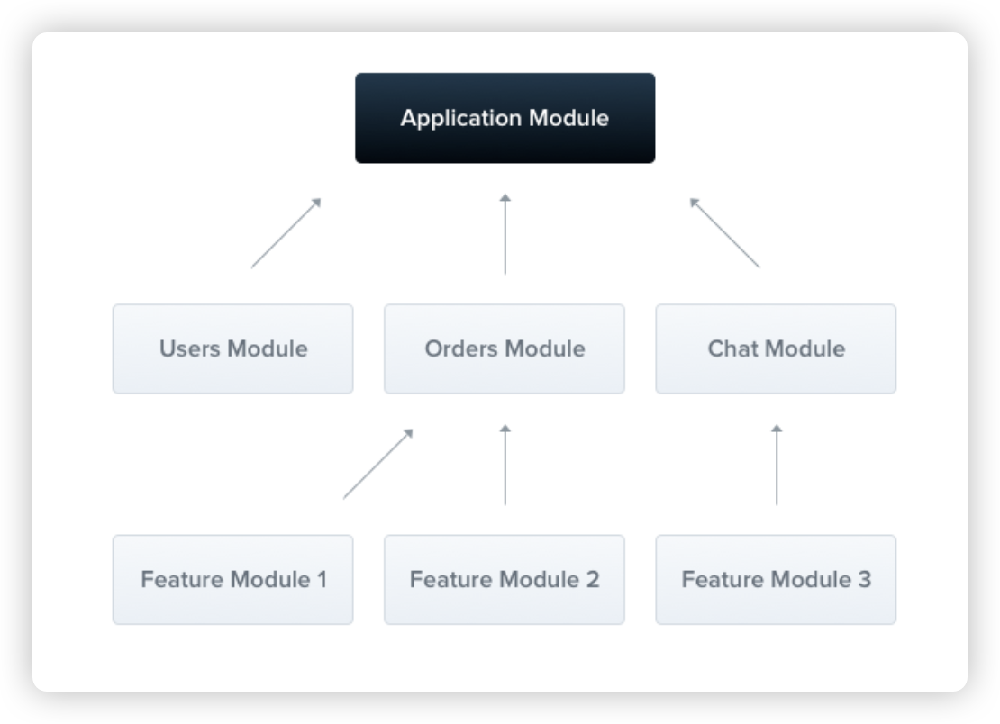

# 7.模块的基本概念
1. 模块是什么：@Module 与依赖关系树
2. @Module 的配置项：controllers、providers、imports
3. 用 CLI 生成模块并自动挂载到根模块
4. 共享模块：用 exports 让服务跨模块可用
5. 全局模块：用 @Global 免除重复导入
6. 动态模块：按参数在运行时生成模块
7. 动态模块的三种约定方法：register、forRoot、forFeature

## 模块是什么：@Module 与依赖关系树

一个 Nest 应用的功能可能非常多，如果把所有控制器、服务都堆在一起，代码会越来越难维护。模块（Module）就是 Nest 用来"分门别类"的容器：把一组相关的控制器（Controller）、服务提供者（Provider）和中间件等组件打包成一个独立的单元。你可以把它理解成一个带标签的抽屉——登录相关的放进 User 模块，订单相关的放进 Order 模块，各管各的，互不干扰。

模块通过类装饰器 `@Module` 来声明（装饰器的概念在第 6 章讲过）。**每个应用都必须要有一个根模块**，默认叫 `AppModule`。Nest 框架在启动时会从根模块出发，逐个收集模块之间互相引用的关系，整理成一张**依赖关系树**；然后按照这棵树，把需要用到的模块对象逐个实例化出来。下图展示的就是这个依赖关系树的示意结构。



在依赖关系树里，**每个模块都有自己独立的作用域**：模块和模块之间的代码是相互隔离的，各自拥有自己的控制器（Controllers）、服务提供者（Providers）、中间件（Middlewares）以及其他组件。一个模块里声明的服务，默认只能在这个模块内部使用，别的模块想用，需要做显式的"导出 + 导入"（这正是下面共享模块、全局模块要解决的问题）。

## @Module 的配置项：controllers、providers、imports

用命令创建一个全新的工程（`nest new` 可缩写为 `nest n`，`-p pnpm` 表示使用 pnpm 作为包管理器）：

```bash
nest n nest-module -p pnpm
```

新工程默认生成的 `app.module.ts` 就是根模块的样子：

```typescript
import { Module } from '@nestjs/common';
import { AppController } from './app.controller';
import { AppService } from './app.service';

@Module({
  imports: [],
  controllers: [AppController],
  providers: [AppService],
})
export class AppModule {}
```

`@Module` 接收一个配置对象，配置对象里最常用的三个字段分别是：

- **`controllers`**：该模块下的控制器集合。控制器负责接收 HTTP 请求并响应（三层架构里的"表现层"，第 3 章讲过）。这里把 `AppController` 注册进去，Nest 才会知道哪些类负责处理路由。
- **`providers`**：该模块下的服务提供者（Service）集合。服务负责具体的业务逻辑（三层架构里的"业务逻辑层"）。这些服务在模块内部是共享的，可以被本模块的控制器、其他服务通过依赖注入使用。这里的 `AppService` 就是这样一个服务。
- **`imports`**：导入应用中的其他模块，这样本模块才能使用对方模块导出的能力。新工程里没有其他模块，所以默认是空数组 `[]`。

> 提示：`AppModule` 作为根模块，会由 Nest 在 `main.ts` 里通过 `NestFactory.create(AppModule)` 加载。整个应用启动时，依赖关系树就是以它为根展开的。

## 用 CLI 生成模块并自动挂载到根模块

除了自己手写，更常用的是用 Nest CLI 快速生成一个完整的资源（resource）。在 `nest-module` 工程根目录下依次执行：

```bash
nest g res user --no-spec
nest g res order --no-spec
```

- `g res` 是 `generate resource` 的缩写：一次生成一整套包含模块、控制器、服务、DTO（数据传输对象）的文件。
- `--no-spec` 表示不生成测试文件（spec 文件），让生成的内容更精简。
- 执行过程中 CLI 会询问使用哪种传输层（Transport layer），选择 **REST API** 即可；还会询问是否生成 CRUD 入口（增删改查接口），按需要选择即可。

两个命令执行后，`UserModule` 和 `OrderModule` 会被**自动写入根模块的 `imports` 数组**，成为 `AppModule` 的子模块：

```typescript
@Module({
  imports: [UserModule, OrderModule],
  controllers: [AppController],
  providers: [AppService],
})
export class AppModule {}
```

在依赖关系树中，`AppModule` 就变成了 `UserModule`、`OrderModule` 的父节点。CLI 之所以能自动完成挂载，是因为它直接修改了 `app.module.ts` 这个文件——这也说明"挂载到根模块"本质上就是在 `imports` 里加上模块引用。

## 共享模块：用 exports 让服务跨模块可用

前面说过，每个模块有独立作用域：`UserModule` 里的 `UserService`，`OrderModule` 默认是用不了的。但实际开发中经常有这样的需求：**Order 模块需要用到 User 模块的 UserService**（比如查订单时要顺带查出下单用户的信息）。

解决思路分两步：User 模块把服务"导出"出去，Order 模块把 User 模块"导入"进来。

**第一步：User 模块导出 UserService。** 在 `@Module` 配置里加一个 `exports` 字段，把要对外开放的服务列出来：

```typescript
// src/user/user.module.ts
@Module({
  controllers: [UserController],
  providers: [UserService],
  // 导出 UserService，以便其他模块可以使用
  exports: [UserService],
})
export class UserModule {}
```

**第二步：Order 模块导入 User 模块。** 在 `imports` 里加上 `UserModule`：

```typescript
// src/order/order.module.ts
@Module({
  // 导入 UserModule，才能使用它导出的 UserService
  imports: [UserModule],
  controllers: [OrderController],
  providers: [OrderService],
})
export class OrderModule {}
```

完成这两步后，`UserService` 就成了一个**共享服务**：在 Order 模块的任何地方都能注入使用。比如在 `order.service.ts` 里用属性注入的方式，把 `UserService` 注入进来：

```typescript
// src/order/order.service.ts
import { Injectable, Inject } from '@nestjs/common';
import { UserService } from '../user/user.service';

@Injectable()
export class OrderService {
  @Inject(UserService)
  private userService: UserService;

  findOne(id: number) {
    console.log('---' + this.userService.findOne(id) + '---');
    return `This action returns a #${id} order`;
  }
}
```

- `@Inject(UserService)` 是属性注入的写法：把 `UserService` 类型的实例注入到 `userService` 这个属性上（注入的几种写法在第 5 章讲过）。
- 这里 `userService` 之所以能用，前提就是 `UserModule` 导出了它、`OrderModule` 又导入了 `UserModule`——少任何一步，注入都会失败。

**小结导出与导入的分工**：`exports` 是"我允许别人用我"，`imports` 是"我要用别人的东西"，两者配合才能实现模块间共享。

## 全局模块：用 @Global 免除重复导入

如果某个模块被很多模块引用，每个地方都要写一遍 `imports: [UserModule]`，会显得很啰嗦。这时可以给模块加上 `@Global()` 装饰器，把它声明成**全局模块**：只要该模块通过 `exports` 导出了某个服务，就相当于全局注入，其他任何模块都不需要再 `imports` 它了。

把上面的 User 模块升级成全局模块：

```typescript
// src/user/user.module.ts
import { Global, Module } from '@nestjs/common';

// 声明为全局模块
@Global()
@Module({
  controllers: [UserController],
  providers: [UserService],
  exports: [UserService],
})
export class UserModule {}
```

此时 Order 模块就可以把 `imports` 里的 `UserModule` 注释掉，一样能用 `UserService`：

```typescript
// src/order/order.module.ts
@Module({
  // 导入 UserModule
  // imports: [UserModule], // UserModule 已是全局模块，无需重复导入
  controllers: [OrderController],
  providers: [OrderService],
})
export class OrderModule {}
```

因为 `UserModule` 已经全局注入了，所以 Order 模块中依然可以正常注入 `UserService`。`@Global()` 的适用场景是那些被大量模块反复使用的通用模块（比如日志、配置、公共工具），用一次声明，省去到处 `imports` 的重复代码。

## 动态模块：按参数在运行时生成模块

前面所有例子里的 `@Module({...})` 都是**静态模块**：模块的定义在写代码时就是固定的，无论在哪导入，结构都一样。而 Nest 还支持**动态模块（Dynamic Module）**：在导入模块的同时传入参数，让模块根据参数在运行时动态生成，常用于读取配置、根据权限或环境判断加载不同内容等场景。

还是先创建模块，使用 CLI 命令：

```bash
nest g res auth --no-spec
```

刚生成时，`auth.module.ts` 是一个普通的静态模块：

```typescript
// src/auth/auth.module.ts
@Module({
  controllers: [AuthController],
  providers: [AuthService],
})
export class AuthModule {}
```

在 AppModule 里，通过 `imports` 静态导入：

```typescript
// src/app.module.ts
@Module({
  imports: [/* ...其他模块... */, AuthModule],
  controllers: [AppController],
  providers: [AppService],
})
export class AppModule {}
```

这样每次 `import` 得到的模块都是一模一样的。**如果希望导入时能传一些参数、按参数生成不同的模块内容，就需要动态模块。**

把 `AuthModule` 改造成动态模块——不再把内容写死在 `@Module` 里，而是提供一个静态方法 `register` 来返回模块定义：

```typescript
// src/auth/auth.module.ts
import { DynamicModule, Module } from '@nestjs/common';
import { AuthService } from './auth.service';
import { AuthController } from './auth.controller';

@Module({})
export class AuthModule {
  static register(options: Record<string, any>): DynamicModule {
    return {
      module: AuthModule,
      controllers: [AuthController],
      providers: [
        {
          provide: 'CONFIG_OPTIONS',
          useValue: options,
        },
        AuthService,
      ],
      exports: [],
    };
  }
}
```

改动点逐条说明：

- 给类新增了一个**静态方法 `register`**（不依赖实例、直接用 `AuthModule.register(...)` 调用），它接收一个 `options` 参数。
- 方法返回的对象类型是 `DynamicModule`，也就是"动态模块定义"。这个对象和 `@Module` 里的配置结构基本一致，但**必须**有 `module: AuthModule` 字段，用来告诉 Nest 这个动态模块对应哪个类。
- 把 `options` 作为一个 **provider** 注册进去：`provide` 是给这个 provider 起一个字符串名字 `'CONFIG_OPTIONS'`，`useValue` 表示直接使用传入的 `options` 这个值（第 5 章讲过 `useValue` 这种 provider 写法）。这样一来，参数就变成了模块内可注入的服务。

现在回到 AppModule，改用方法调用的方式导入，并可以随时传不同的参数：

```typescript
// src/app.module.ts
@Module({
  imports: [
    // ...其他模块...
    AuthModule.register({
      role: 'admin',
      type: 'auth',
    }),
  ],
  controllers: [AppController],
  providers: [AppService],
})
export class AppModule {}
```

注意 `imports` 里不再是 `AuthModule` 这个类，而是 `AuthModule.register({...})` 的**返回值**（一个动态模块定义对象）。传入的参数通过 `CONFIG_OPTIONS` 这个 provider 保存在模块内，任何需要的地方都能注入它。

在 `AuthController` 的构造函数里，用字符串 token 把它注入出来：

```typescript
// src/auth/auth.controller.ts
import { Controller, Get, Inject } from '@nestjs/common';
import { AuthService } from './auth.service';

@Controller('auth')
export class AuthController {
  constructor(
    private readonly authService: AuthService,
    @Inject('CONFIG_OPTIONS') private readonly options: Record<string, any>,
  ) {}

  @Get()
  findAll() {
    console.log(this.options);
    return this.authService.findAll();
  }
}
```

`@Inject('CONFIG_OPTIONS')` 表示按字符串名字 `CONFIG_OPTIONS` 去容器里找对应的 provider，注入到 `options` 属性。启动应用后访问 `GET /auth`，控制器方法 `findAll()` 里的 `console.log(this.options)` 就会打印出注册时传入的那个对象，也就是 `{ role: 'admin', type: 'auth' }`。

> 提示：同一套注册代码，只要改一下传入的参数，就能得到配置不同的动态模块，例如下次调用 `AuthModule.register({ role: 'guest', type: 'auth' })`，`options` 拿到的就是另一份配置。

## 动态模块的三种约定方法：register、forRoot、forFeature

方法名叫 `register` 只是举例子，其实叫什么都可以，但 Nest 社区约定了 3 个常用的方法名，分别代表不同的用途：

- **`register`**：用一次传一次配置。每次调用都可以传不同的配置，比如这次 `AuthModule.register({ role: 'admin' })`，下次 `AuthModule.register({ role: 'guest' })`。适合每个使用方配置都不一样的场景。
- **`forRoot`**：配置一次，多次使用。通常用来注册**根级模块**，比如配置根模块的全局服务、全局中间件等。相当于"一次性设置好，全局都在用"。
- **`forFeature`**：配合 `forRoot` 使用。`forRoot` 定下了整个模块的基础配置，`forFeature` 用来给某个具体功能补充专属配置。比如用 `forRoot` 指定数据库连接等基础信息，再用 `forFeature` 指定某个模块要访问哪张表。

这三个方法名本身没有魔法，真正起作用的还是"静态方法返回动态模块定义"这套机制；约定只是让代码读起来更容易理解意图。后面课程使用 TypeORM 数据库库时，`forRoot` 和 `forFeature` 会成对出现，到时候看到用法就清楚了。
