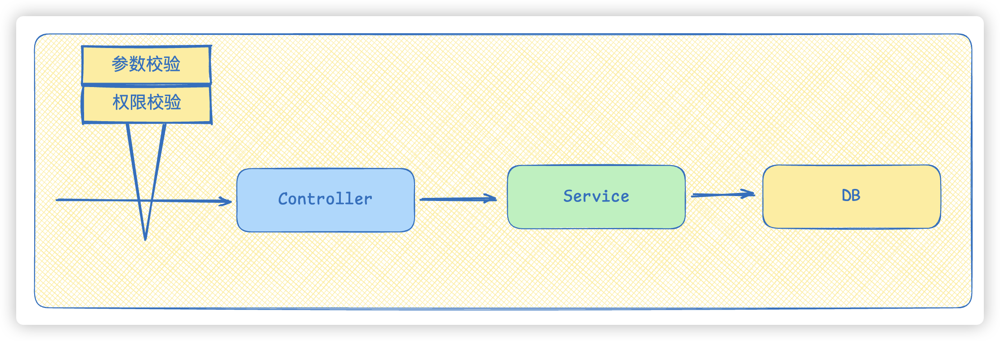
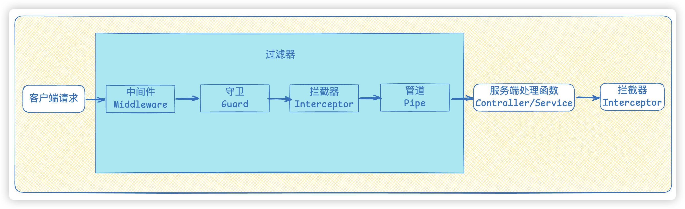
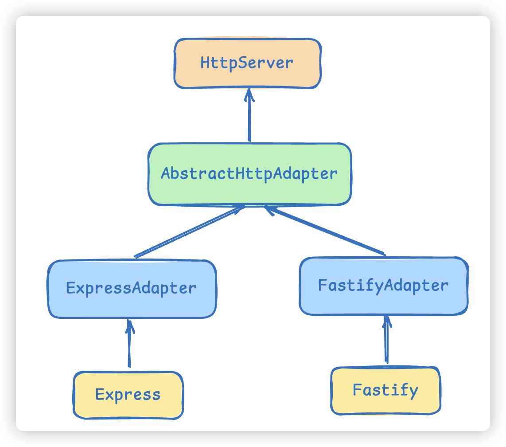

# 08.什么是AOP

1. AOP 的概念与作用
2. AOP 的核心术语
3. NestJS 中的 AOP 实现

## AOP 的概念与作用

### 问题场景

在一个典型的 HTTP 请求处理流程中，客户端发送请求后会依次经过 Controller（控制器）、Service（服务层）、DB（数据访问层）等多个模块：



上图展示了请求经过的三个核心模块：Controller 负责接收请求和返回响应，Service 负责业务逻辑处理，DB 负责数据存取。

如果现在需要在这些模块中加入一些**公共操作**，例如：

- 数据验证（检查请求参数是否合法）
- 权限校验（判断用户是否有权限访问）
- 日志记录（记录每次请求的详细信息）
- 性能监控（统计每个接口的响应耗时）

你可能会想到在每个 Controller 中分别加入这些逻辑。但是，**如果有多个功能模块都需要进行校验，且校验逻辑几乎相同**，那就意味着需要在多个 Controller 中重复编写同一段代码。

### 核心问题：公共逻辑与业务逻辑耦合

重复编写公共逻辑会导致两个严重问题：

1. **代码冗余**：同样的校验代码分散在各个模块中，增加了维护成本
2. **耦合度高**：公共逻辑（如权限校验）与业务逻辑（如创建订单）混杂在一起，当公共逻辑变化时，所有相关业务代码都需要修改

### AOP 的解决方案

AOP（Aspect-Oriented Programming，面向切面编程）提供了一种优雅的解决方式：


如图所示，在 Controller 层的前后，可以各自"**切一刀**"，把公共逻辑（如日志、权限校验）放在这个切面中统一处理。这样一来，公共逻辑不会侵入 Controller、Service 等业务代码，实现了**关注点分离**。

### 什么是 AOP

**AOP（Aspect-Oriented Programming，面向切面编程）** 是一种编程范式，它通过**分离关注点**来增强代码的模块化。AOP 允许开发者在不改变原有代码的前提下，在程序的特定位置添加行为，通常用于实现**横切关注点**（cross-cutting concerns），如：

- 日志记录
- 性能监控
- 安全检查
- 事务管理

## AOP 的核心术语

AOP 体系中有几个重要的概念，理解它们有助于掌握 AOP 的工作方式：

### 切面（Aspect）

切面是用来定义**横切关注点**的模块。它包含了额外的行为和逻辑，可以在程序的不同部分被动态织入。简单说，**切面就是"切"进去的那部分代码**，比如日志切面、权限切面。

### 连接点（Join Point）

连接点是程序执行过程中**可以插入切面的特定点**。例如：

- 方法调用时
- 方法执行时
- 属性访问时

### 切入点（Pointcut）

切入点定义了**在什么条件下插入切面逻辑**。它通常通过表达式来匹配连接点。比如"匹配所有 Controller 中以 `get` 开头的方法"就是一个切入点表达式。

### 通知（Advice）

通知是切面在连接点上执行的**实际行为**。通知可以在连接点之前、之后或环绕执行，分为三种类型：

- **前置通知（Before Advice）**：在方法执行前执行，常用于参数校验、权限检查
- **后置通知（After Advice）**：在方法执行后执行，常用于日志记录、资源清理
- **环绕通知（Around Advice）**：在方法执行前后都执行，开发者可以完全控制方法的执行流程，常用于性能监控、事务管理

### 目标对象（Target Object）

目标对象是**被切面增强的原始对象**，也就是被"切"的那个对象，比如某个 Controller 或 Service。

### 织入（Weaving）

织入是**将切面应用到目标对象的过程**，有以下几种方式：

- **编译期织入**：在编译阶段将切面代码织入目标类
- **加载期织入**：在类加载时使用类加载器动态地将切面织入
- **运行期织入**：在运行时使用代理模式将切面织入目标对象

## NestJS 中的 AOP 实现

### 从 NestJS 请求流程看 AOP

在 NestJS 中，请求流程可以从 AOP 的角度重新审视：



上图中，中间区域属于 AOP 切面部分（图中标为 AOE——Aspect Oriented Environment），包含这五个核心组件：

| 组件 | 中文名 | 作用 |
|------|--------|------|
| **Middleware** | 中间件 | 在请求到达路由处理前执行，常用于日志、CORS、Session |
| **Guard** | 守卫 | 决定请求是否被处理，常用于权限校验 |
| **Interceptor** | 拦截器 | 在方法执行前后附加额外逻辑，可转换请求/响应数据 |
| **Pipe** | 管道 | 对输入数据进行转换和验证 |
| **Filter** | 过滤器 | 处理异常，返回自定义错误响应 |

它们都是 **AOP 思想在 NestJS 中的具体实现**，通过不同的切入点来增强业务代码。

### 代码演示：理解 AOP 的核心机制

下面的代码通过**函数式编程**方式演示了 Before、After、Around 三种通知的工作方式，帮助你直观理解 AOP 的执行流程。

**JavaScript 示例代码**（`代码/my-aop/main.js`）：

```javascript
// 前置通知：在函数执行前插入逻辑
function before(fn, beforeFn) {
  return function (...args) {
    beforeFn(...args);             // 先执行增强逻辑（如：日志、验证等）
    return fn(...args);            // 再执行原函数
  };
}

// 后置通知：在函数执行后插入逻辑
function after(fn, afterFn) {
  return function (...args) {
    const result = fn(...args);    // 先执行原函数
    afterFn(result, ...args);      // 再执行增强逻辑（如：修改结果、日志等）
    return result;
  };
}

// 环绕通知：在函数执行前后都插入逻辑
function around(fn, aroundFn) {
  return function (...args) {
    return aroundFn(fn, args);     // 将原函数交给增强函数，由增强函数决定何时执行
  };
}

// 原始函数
function greet(name) {
  console.log(`Hello, ${name}!`);
  return `Hello, ${name}!`;
}

// 增强：在函数执行前输出日志
const greetWithBefore = before(greet, (name) => {
  console.log(`About to greet: ${name}`);
});

// 增强：在函数执行后输出日志
const greetWithAfter = after(greet, (result, name) => {
  console.log(`Greeted ${name} with result: ${result}`);
});

// 增强：围绕函数执行进行操作（例如修改参数、修改返回值等）
const greetWithAround = around(greet, (fn, args) => {
  console.log('Around before');
  const result = fn(...args);      // 执行原始函数
  console.log('Around after');
  return result;
});

// 执行
greetWithBefore('jack');
console.log("---------------------------")
greetWithAfter('rose');
console.log("---------------------------")
greetWithAround('bob');
```

**代码说明**：

- `before` 函数：接收原始函数 fn 和增强函数 beforeFn，返回一个新函数。新函数先执行增强逻辑（如日志），再执行原始逻辑。这就是**前置通知**的工作方式。
- `after` 函数：先执行原始函数，再将结果传给增强函数处理。这是**后置通知**的工作方式。
- `around` 函数：将原始函数完全交给增强函数掌控，增强函数可以在任意时机执行原始函数，甚至修改参数和返回值。这就是**环绕通知**的工作方式。
- 最后的三个调用分别演示了三种通知的效果，运行后会依次输出增强前后的日志信息。

### 使用 TypeScript 装饰器实现 AOP

在 NestJS 中，AOP 功能通常通过**装饰器**实现。下面是使用 TypeScript 装饰器版本的 AOP 示例。

**TypeScript 装饰器定义**（`代码/my-aop/src/aop.ts`）：

```typescript
// 定义 Before 装饰器
export function Before(fn: Function) {
  return function (target: any, propertyKey: string, descriptor: PropertyDescriptor) {
    const originalMethod = descriptor.value;

    descriptor.value = function (...args: any[]) {
      fn(...args);                                // 执行增强逻辑（如：日志、验证等）
      return originalMethod.apply(this, args);     // 执行原始方法
    };
  };
}

// 定义 After 装饰器
export function After(fn: Function) {
  return function (target: any, propertyKey: string, descriptor: PropertyDescriptor) {
    const originalMethod = descriptor.value;

    descriptor.value = function (...args: any[]) {
      const result = originalMethod.apply(this, args);  // 执行原始方法
      fn(result, ...args);                              // 执行增强逻辑（如：修改返回值、日志等）
      return result;
    };
  };
}

// 定义 Around 装饰器
export function Around(fn: Function) {
  return function (target: any, propertyKey: string, descriptor: PropertyDescriptor) {
    const originalMethod = descriptor.value;

    descriptor.value = function (...args: any[]) {
      fn(originalMethod, args);                    // 在原方法执行前后插入逻辑
      return originalMethod.apply(this, args);     // 执行原始方法
    };
  };
}
```

**TypeScript 使用示例**（`代码/my-aop/src/main.ts`）：

```typescript
import { Before, After, Around } from "./aop";

class ExampleService {
  // @Before((name: string) => {
  //   console.log(`Before method execution: preparing to greet ${name}`);
  // })
  // @After((result: string, name: string) => {
  //   console.log(
  //     `After method execution: greeted ${name} with result "${result}"`
  //   );
  // })
  @Around((fn: Function, args: any[]) => {
    console.log("Around before method execution");
    const result = fn(...args);            // 执行原始方法
    console.log("Around after method execution");
    return result;
  })
  greet(name: string): string {
    console.log(`Hello, ${name}!`);
    return `Hello, ${name}!`;
  }
}

const exampleService = new ExampleService();
const result = exampleService.greet("jack");
```

**代码说明**：

- 这个示例使用 TypeScript 装饰器（`@Before`、`@After`、`@Around`）来标记需要增强的方法。NestJS 内部大量使用了类似的装饰器机制。
- 代码中同时注释了 `@Before` 和 `@After`，只启用了 `@Around`。实际使用时，你可以**同时使用多个装饰器**来叠加不同的增强逻辑，比如先用 `@Before` 做权限校验，再用 `@Around` 做日志记录。
- `Around` 装饰器接收一个函数，该函数可以控制原始方法的执行时机，这是 AOP 中最灵活的一种通知类型。
- 运行 `exampleService.greet("jack")` 时，会先输出 "Around before method execution"，然后输出 "Hello, jack!"，最后输出 "Around after method execution"。

### AOP 思维示意图

下图展示了 AOP 如何将横切关注点从业务逻辑中分离出来：



上图展示了 AOP 的核心思想：将分散在各处的横切关注点（如日志、安全、事务）集中到切面中，在程序执行的特定连接点织入这些切面逻辑，从而保持业务代码的纯粹性。

## 总结

AOP 是一种通过分离关注点来提高代码模块化的编程范式。它的核心思想是：

1. 识别出程序中分散在各处的**横切关注点**（如日志、权限、事务）
2. 将这些公共逻辑封装成**切面**
3. 在**切入点**定义的条件下，通过**通知**将切面织入目标对象的**连接点**

在 NestJS 中，AOP 思想通过 Middleware、Guard、Interceptor、Pipe、Filter 五个组件得到了完整的实现，它们是后续课程的核心内容。