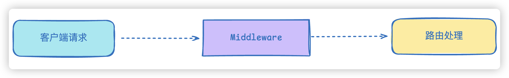
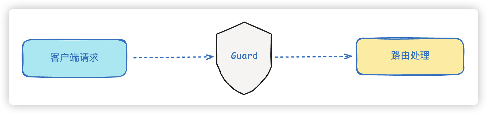

# 09.中间件与守卫

1. 中间件（Middleware）
2. 守卫（Guard）

在上一章我们了解到，NestJS 通过 Middleware、Guard、Interceptor、Pipe、Filter 五个组件实现了 AOP（面向切面编程）。本章先讲解其中最容易理解的两个：**中间件（Middleware）**和**守卫（Guard）**。它们都能在请求进入业务代码前后插入公共逻辑，把日志、权限这类横切关注点从业务代码中分离出来。

## 中间件（Middleware）

### 什么是中间件

中间件是 Express 里已有的概念。NestJS 的底层默认使用 Express，所以中间件的执行时机也继承自 Express：它在请求流程中的位置大致如下：



从上图可以看出，中间件位于客户端请求与路由处理程序（Controller）之间。它可以：

- 在**请求到达路由处理程序之前**执行某些任务（例如打印请求日志、校验请求格式）
- 在**请求被处理之后**执行某些任务（例如记录响应状态码）

在 NestJS 中，中间件被进一步划分为**全局中间件**和**局部中间件**。全局中间件作用于整个应用的所有路由，局部中间件只作用于指定的模块或路由。

### 创建中间件

NestJS 提供了命令行工具来快速生成中间件，命令格式为：

```bash
nest g mi [中间件名称]
```

例如要生成名为 `person` 的中间件，运行：

```bash
nest g mi person
```

这会在 `person` 文件夹下自动创建 `person.middleware.ts` 文件。

一个最基本的中间件代码如下（`person/person.middleware.ts`）：

```typescript
import { Injectable, NestMiddleware } from '@nestjs/common';
import { Request, Response, NextFunction } from 'express';

@Injectable()
export class PersonMiddleware implements NestMiddleware {
  use(req: Request, res: Response, next: NextFunction) {
    console.log('before 中间件 ---' + req.url);
    next();
    console.log('after 中间件 ---' + res.statusCode);
  }
}
```

**代码说明**：

- `PersonMiddleware` 实现了 NestJS 提供的 `NestMiddleware` 接口，接口要求必须实现 `use` 方法。
- `use` 方法接收三个参数：`req`（请求对象）、`res`（响应对象）、`next`（下一个处理函数）。
- 调用 `next()` 表示请求继续向后传递。在 `next()` 之前执行的代码属于"路由前"逻辑，在 `next()` 之后执行的代码属于"路由后"逻辑。
- 默认生成的 `req`、`res` 参数类型都是 `any`，`next` 是一个无参函数 `() => void`。这里显式引入了 `express` 的 `Request`、`Response`、`NextFunction` 类型，让参数类型更准确。

### 在模块中局部绑定中间件

要让中间件生效，需要把它绑定到某个模块。让 `PersonModule` 实现 `NestModule` 接口，并在 `configure` 方法中调用 `consumer.apply(...).forRoutes(...)`：

```typescript
import { MiddlewareConsumer, Module, NestModule, RequestMethod } from '@nestjs/common';
import { PersonService } from './person.service';
import { PersonController } from './person.controller';
import { PersonMiddleware } from './person.middleware';

@Module({
  controllers: [PersonController],
  providers: [PersonService],
  exports: [PersonService],
})
export class PersonModule implements NestModule {
  configure(consumer: MiddlewareConsumer) {
    consumer.apply(PersonMiddleware).forRoutes({
      path: '/person',
      method: RequestMethod.GET,
    });
  }
}
```

**代码说明**：

- `consumer.apply(PersonMiddleware)` 声明要使用的中间件。
- `forRoutes(...)` 指定中间件覆盖的路由。这里传入一个对象，用 `path` 指定路径为 `/person`，用 `method: RequestMethod.GET` 限定只对 GET 请求生效。
- 也可以直接用控制器类 `forRoutes(PersonController)`，表示该中间件覆盖这个控制器下的所有路由。

此时启动应用并访问 `/person`，后端控制台会依次打印：

```text
before 中间件 ---/person
person controller
after 中间件 ---200
```

**预期效果说明**：请求 `/person` 时，先打印 `before 中间件`，再打印控制器内部的输出（示例中是 `person controller`），最后打印 `after 中间件` 及响应状态码 `200`，完整演示了"路由前 → 业务处理 → 路由后"的执行顺序。

### 中间件中的依赖注入

类中间件比普通函数更强大的一点是：它**能够进行依赖注入**。也就是说，我们可以在中间件内注入某个 Service，并调用其中的方法，例如在 `PersonMiddleware` 中注入 `PersonService`：

```typescript
import { Inject, Injectable, NestMiddleware } from '@nestjs/common';
import { Request, Response, NextFunction } from 'express';
import { PersonService } from './person.service';

@Injectable()
export class PersonMiddleware implements NestMiddleware {
  @Inject(PersonService)
  private personService: PersonService;

  use(req: Request, res: Response, next: NextFunction) {
    console.log('before 中间件 ---' + req.url);
    console.log('调用注入的服务 --- ' + this.personService.findAll());
    next();
    console.log('after 中间件 ---' + res.statusCode);
  }
}
```

**代码说明**：

- 用 `@Inject(PersonService)` 装饰器配合 `private personService` 属性，请求 `PersonService` 的实例。
- 在 `use` 方法中可以调用 `this.personService.findAll()` 等业务方法。要注意 `PersonService` 需要被放进制器容器中（这里是它的所属模块 `PersonModule` 的 `providers` 中）并且能在该中间件所在的模块中访问到，因此 `PersonModule` 还需要在 `exports` 中把 `PersonService` 导出。

### 函数式中间件

如果中间件**不需要依赖注入**，也可以使用更轻量的函数式中间件，写法与普通函数差别不大：

```typescript
export function PersonMiddleware(req: Request, res: Response, next: NextFunction) {
  console.log('before 函数中间件 ---' + req.url);
  next();
  console.log('after 函数中间件 ---' + res.statusCode);
}
```

**代码说明**：函数式中间件直接导出一个接收 `req`、`res`、`next` 的函数，没有 `@Injectable()` 装饰器，也不能注入依赖。是否采用函数式中间件，取决于当前中间件是否有依赖注入需求。

### 全局中间件

除了在局部（模块内）绑定，中间件也可以**直接在全局启用**，作用于应用的所有路由。先生成一个名为 `logger` 的中间件：

```bash
nest g mi logger
```

其内容如下（`logger.middleware.ts`）：

```typescript
import { Injectable, NestMiddleware } from '@nestjs/common';
import { NextFunction, Request, Response } from 'express';

@Injectable()
export class LoggerMiddleware implements NestMiddleware {
  use(req: Request, res: Response, next: NextFunction) {
    console.log('before 全局中间件 --- ' + req.url);
    next();
    console.log('after 全局中间件 --- ' + res.statusCode);
  }
}
```

在入口文件 `main.ts` 中通过 `app.use(...)` 全局引入：

```typescript
import { NestFactory } from '@nestjs/core';
import { AppModule } from './app.module';
import { LoggerMiddleware } from './logger.middleware';

async function bootstrap() {
  const app = await NestFactory.create(AppModule);
  app.use(new LoggerMiddleware().use);
  await app.listen(process.env.PORT ?? 3000);
}
bootstrap();
```

**代码说明**：

- `app` 是 NestJS 内部基于 Express 创建的应用实例，因此可以直接调用 Express 的 `app.use()` 注册中间件。
- 由于类中间件不能直接传给 `use`，这里用 `new LoggerMiddleware().use` 取出其实例的 `use` 方法传给 `app.use`。
- `await app.listen(process.env.PORT ?? 3000)` 表示监听 `3000` 端口（或环境变量 `PORT` 指定的端口）。

这样配置后，**应用内的所有请求**都会先经过 `LoggerMiddleware`，控制台会为每次请求打印 `before 全局中间件` 和 `after 全局中间件` 两行日志。

## 守卫（Guard）

### 什么是守卫

守卫的职责十分明确：通常用于**权限、角色等授权操作**。它和中间件类似，可以对请求进行拦截和过滤，因此也可以理解为**路由守卫**——在调用某个 Controller 之前判断权限，返回 `true` 或 `false` 来决定是否放行请求。



从上图可以看出，守卫同样位于客户端请求与路由处理程序之间，它**在调用路由程序之前**根据返回的 `true` 或 `false` 决定是否放行。守卫也分为**全局守卫**和**局部守卫**。

### 创建守卫

同样可以使用命令行工具创建守卫：

```bash
nest g gu person
```

这会自动在 `person` 文件夹下创建 `person.guard.ts` 文件。

要成为一个守卫，必须实现 `CanActivate` 接口中的 `canActivate()` 方法：

```typescript
import { CanActivate, ExecutionContext, Injectable } from '@nestjs/common';
import { Observable } from 'rxjs';

@Injectable()
export class PersonGuard implements CanActivate {
  canActivate(
    context: ExecutionContext,
  ): boolean | Promise<boolean> | Observable<boolean> {
    console.log('person guard');
    return true;
  }
}
```

**代码说明**：

- `canActivate` 方法接收一个 `context: ExecutionContext` 参数，它包含当前请求的上下文信息。
- `canActivate` 的返回值可以是 `boolean`、`Promise<boolean>` 或 `Observable<boolean>`，支持同步和异步两种写法。
- 示例直接返回 `true`，表示放行请求。

### 局部绑定守卫

局部绑定可以直接在 `Controller` 类上添加 `@UseGuards` 装饰器：

```typescript
import { Controller, Get, UseGuards } from '@nestjs/common';
import { PersonGuard } from './person.guard';

@Controller('person')
@UseGuards(PersonGuard)
export class PersonController {
  @Get()
  findAll() {
    return 'person controller findAll';
  }
}
```

对 `PersonController` 应用 `@UseGuards(PersonGuard)` 后，访问 `/person` 时控制台打印如下：

```text
before 中间件 ---/person
person guard
after 中间件 ---200
person controller
```

**说明**：可以看到守卫在中间件之后、控制器业务代码之前执行。把 `canActivate` 的返回值改成 `false`，请求则会被拒绝，返回如下 JSON：

```text
{"message":"Forbidden resource","error":"Forbidden","statusCode":403}
```

也就是 403 禁止访问。**Controller 本身不需要做任何修改，却透明地加上了权限判断逻辑，这正是 AOP 架构的好处**。

### 全局启用守卫

和中间件类似，守卫也可以全局启用。有两种方式。

#### 方式一：在 main.ts 中使用 useGlobalGuards

```typescript
import { NestFactory } from '@nestjs/core';
import { AppModule } from './app.module';
import { LoggerMiddleware } from './logger.middleware';
import { PersonGuard } from './person/person.guard';

async function bootstrap() {
  const app = await NestFactory.create(AppModule);
  app.use(new LoggerMiddleware().use);
  app.useGlobalGuards(new PersonGuard());
  await app.listen(process.env.PORT ?? 3000);
}
bootstrap();
```

这样**每个路由**都会应用这个守卫。

**需要注意的问题**：这种方式是通过 `new PersonGuard()` 自己创建实例，**这个实例不在 IoC 容器中**。因此它无法获取容器中注入的内容。如果一个守卫内部需要注入某个 Service（例如 `PersonService`），通过 `new` 创建时该注入无法生效。比如下面的代码：

```typescript
@Injectable()
export class PersonGuard implements CanActivate {
  @Inject(PersonService)
  private personService: PersonService;

  canActivate(
    context: ExecutionContext,
  ): boolean | Promise<boolean> | Observable<boolean> {
    console.log('person guard ---' + this.personService.findAll());
    return true;
  }
}
```

此时因为 `PersonGuard` 是自己 `new` 出来的，没有被 IoC 容器托管，`this.personService` 是 `undefined`。访问 `/person` 会在后台直接报错，前台提示 500 错误：

```text
ERROR [ExceptionsHandler] Cannot read properties of undefined (reading 'findAll')

{"statusCode":500,"message":"Internal server error"}
```

#### 方式二：在 AppModule 中利用 APP_GUARD 注册

为了解决依赖注入问题，NestJS 提供了另一种全局注册方式：在 `AppModule` 中通过 `APP_GUARD` 这个 token 注册守卫。**记得把之前用 `new` 创建的守卫注释掉**：

```typescript
import { Module } from '@nestjs/common';
import { APP_GUARD } from '@nestjs/core';
import { AppController } from './app.controller';
import { AppService } from './app.service';
import { PersonModule } from './person/person.module';
import { PersonGuard } from './person/person.guard';

@Module({
  imports: [PersonModule],
  controllers: [AppController],
  providers: [
    AppService,
    {
      provide: APP_GUARD,
      useClass: PersonGuard,
    },
  ],
})
export class AppModule {}
```

**代码说明**：

- `APP_GUARD` 是 NestJS 从 `@nestjs/core` 导出的一个特殊 token。在 `providers` 中提供一个 `{ provide: APP_GUARD, useClass: PersonGuard }`，就能让 `PersonGuard` 作为**应用级守卫**生效。
- 与方式一不同，这种注册方式把 `PersonGuard` 交给了 IoC 容器托管，因此**支持依赖注入**，守卫内部注入的 `PersonService` 可以正常使用。

## 总结

- **中间件**继承自 Express，位于请求到达路由处理程序之前或之后，分为全局中间件和局部中间件。类中间件支持依赖注入，函数式中间件更轻量但不支持注入。
- **守卫**用于权限判断，通过 `canActivate()` 返回 `true`/`false` 决定是否放行，分为全局守卫和局部守卫。
- 全局守卫两种注册方式中，`app.useGlobalGuards(new ...)` 创建的实例不在 IoC 容器中，**无法依赖注入**；在 `AppModule` 中用 `APP_GUARD` 注册的方式把守卫交给 IoC 容器托管，**可以正常依赖注入**，推荐使用。
- 守卫执行的时机晚于中间件：请求会先经过中间件，再经过守卫，最后进入 Controller 的业务代码。