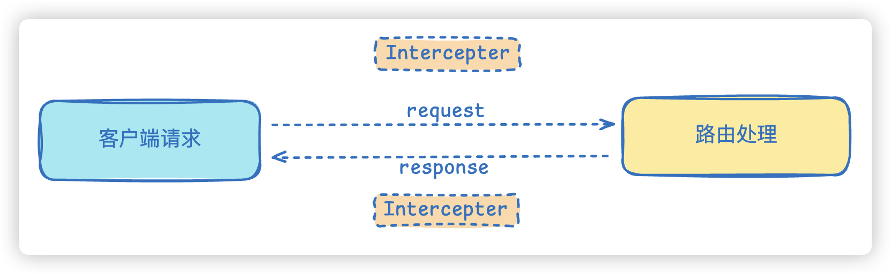

# 10.拦截器

1. 拦截器的概念与作用
2. RxJS 基础
3. 创建拦截器
4. 绑定拦截器
5. 使用 RxJS 操作符处理响应

在上一章我们学习了中间件和守卫，它们分别在请求进入路由处理程序前后执行特定逻辑。本章要讲的**拦截器（Interceptor）**更加强大：它既可以在路由处理之前执行逻辑，也可以在路由处理之后操作响应数据，是 AOP 架构中最灵活的组件之一。

## 拦截器的概念与作用

拦截器（Interceptor）是 NestJS 利用 RxJS 的 Observable 数据流实现的 AOP 组件。与中间件和守卫不同，拦截器在**路由请求之前和之后都可以进行逻辑处理**，能够充分操作 `request` 和 `response` 对象。



**图片说明**：拦截器位于客户端请求与路由处理程序之间，它包裹着路由处理逻辑（`next.handle()`），因此可以在路由处理之前执行代码，也可以在路由处理之后通过 `Observable` 对响应数据进行转换或操作。

拦截器的常见使用场景包括：

- **记录请求日志** —— 在路由处理前打印请求信息，处理后打印响应状态
- **转换响应数据** —— 对控制器返回的数据进行统一格式化、加密或脱敏
- **错误处理** —— 拦截抛出异常，统一处理错误格式
- **缓存控制** —— 根据请求头或路由信息设置缓存策略
- **性能监控** —— 统计路由处理耗时

## RxJS 基础

拦截器内部基于 **RxJS（Reactive Extensions for JavaScript）** 实现。RxJS 是一个处理异步数据流的 JavaScript 库，它的核心思想是使用 `Observable` 对象来代表一个数据流，通过操作符对数据流进行转换和组合。

你可以把 RxJS 理解为 JavaScript 版的管道工具。不过不要增加心智负担——目前只需要理解它最基本的工作原理即可。

### Observable 的工作原理


**图片说明**：上图展示了 Observable 的生命周期。数据源（Observable）产生数据，经过一系列操作符（Operators）的处理，最后传递给接收者（Subscriber）。

Observable 的工作流程包含四个步骤：

1. **创建 Observable** —— 使用 `new Observable()` 或 RxJS 提供的创建函数（如 `of()`、`from()`、`interval()`）创建一个数据流。
2. **订阅 Observable** —— 调用 `subscribe()` 方法启动数据流，并指定如何处理数据（`next` 处理值，`error` 处理错误，`complete` 处理流结束）。
3. **发出数据** —— Observable 根据内部逻辑按顺序发出数据，每发一个值就调用 `next()`。
4. **终止流** —— 调用 `complete()` 表示数据流正常结束，或调用 `error()` 表示发生错误。

下面的代码演示了创建一个最简单的 Observable：

```typescript
import { Observable } from 'rxjs';

// 创建一个简单的 Observable，依次发出 'Hello' 和 'World'
const observable = new Observable((subscriber) => {
  subscriber.next('Hello');
  subscriber.next('World');
  subscriber.complete(); // 表示流结束
});

// 订阅 Observable
observable.subscribe({
  next(value) {
    console.log(value);
  }, // 处理每个值，输出: Hello → World
  complete() {
    console.log('Complete!');
  }, // 流结束时输出: Complete!
});
```

**代码说明**：这段代码创建了一个 Observable，它依次发出两个字符串值然后结束。订阅时，`next` 函数收到每个值并打印，`complete` 函数在流结束时被调用。

### 使用创建函数

RxJS 提供了多个便捷函数来创建 Observable：

```typescript
import { of } from 'rxjs';

// of() 将多个值直接转换为 Observable
const observable = of(1, 2, 3, 4, 5);

observable.subscribe({
  next(value) {
    console.log(value); // 依次输出: 1 2 3 4 5
  },
  complete() {
    console.log('Complete!');
  },
});
```

**代码说明**：`of(1, 2, 3, 4, 5)` 创建了一个依次发射 1 到 5 这五个数值的 Observable，每发射一个值，`subscribe` 中的 `next` 就会被调用一次。

`from()` 函数可以将 Promise 或数组转换为 Observable：

```typescript
import { from } from 'rxjs';

const promise = new Promise((resolve) =>
  setTimeout(() => resolve('Hello World'), 1000)
);

const observable = from(promise); // 将 Promise 转化为 Observable

observable.subscribe({
  next(value) {
    console.log(value); // 1 秒后输出: Hello World
  },
  complete() {
    console.log('Complete!');
  },
});
```

**代码说明**：`from(promise)` 把 Promise 包装成 Observable，Promise 决议后 Observable 发出结果值并结束。这可以让异步操作以统一的数据流方式处理。

### 操作符

RxJS 的强大之处在于它提供了大量的**操作符（Operators）**，用于对数据流进行转换、过滤、组合等操作。使用 `pipe()` 方法将多个操作符串联起来：

```typescript
import { of } from 'rxjs';
import { map, filter } from 'rxjs/operators';

of(1, 2, 3, 4, 5)
  .pipe(map((x) => x * x))        // 每个值平方: 1, 4, 9, 16, 25
  .pipe(filter((x) => x % 2 !== 0)) // 过滤出奇数: 1, 9, 25
  .subscribe((v) => console.log(`打印: ${v}`));
// 输出:
// 打印: 1
// 打印: 9
// 打印: 25
```

**代码说明**：`map` 操作符将每个值进行变换（平方），`filter` 操作符筛选出满足条件的值（奇数）。数据从源头经过管道中的操作符一步步处理，最终到达 `subscribe`。

除了 `map` 和 `filter`，拦截器中还会用到下面几个操作符：

| 操作符 | 作用 |
|--------|------|
| `tap` | 不改变数据，只用来执行副作用（如打印日志） |
| `toArray` | 将所有发出的值收集为一个数组，在流结束时发出 |
| `catchError` | 捕获数据流中的错误，进行错误处理 |
| `concatMap` | 串行执行异步操作，一个完成后才执行下一个 |
| `forkJoin` | 并发执行多个异步操作，等待所有完成 |

**操作符说明**：后面在 AuthInterceptor 的示例中会看到 `tap`、`toArray`、`catchError` 的实际用法。`concatMap` 用于串行执行 Promise 的场景——例如需要在数据库中按顺序查询多条记录时；`forkJoin` 用于并发执行多个 Promise，待所有结果返回后统一处理，类似于 `Promise.all`。

### 处理多个 Promise

如果有多个 Promise，RxJS 可以灵活地控制它们的执行方式：

```typescript
import { from } from 'rxjs';
import { concatMap } from 'rxjs/operators';

const promise1 = new Promise((resolve) =>
  setTimeout(() => resolve('Hello'), 500)
);
const promise2 = new Promise((resolve) =>
  setTimeout(() => resolve('World'), 1000)
);
const promise3 = new Promise((resolve) =>
  setTimeout(() => resolve('!'), 1500)
);

const promises = [promise1, promise2, promise3];

// concatMap 串行执行: 一个一个按顺序执行
from(promises)
  .pipe(concatMap((promise) => from(promise)))
  .subscribe({
    next(value) {
      console.log(value); // 顺序输出: Hello → World → !
    },
    complete() {
      console.log('Complete!');
    },
  });
```

**代码说明**：`from(promises)` 依次发出三个 Promise，`concatMap` 确保每个 Promise 执行完成后才进入下一个，最终结果是按顺序输出的。

如果希望多个 Promise 并发执行（同时发起，等全部完成），使用 `forkJoin`：

```typescript
import { forkJoin } from 'rxjs';

forkJoin([promise1, promise2, promise3]) // 并发执行所有 Promise
  .subscribe({
    next(values) {
      console.log(values); // 约 2 秒后输出: ['Hello', 'World', '!']
    },
    complete() {
      console.log('Complete!');
    },
  });
```

**代码说明**：`forkJoin` 类似于 `Promise.all`，它会同时启动所有 Promise，等所有 Promise 都完成后，将结果以数组形式一次性发出。

> 更多操作符请查阅 [RxJS 官方文档](https://rxjs.dev/guide/operators#categories-of-operators)。

## 创建拦截器

使用 NestJS 的命令行工具快速创建拦截器：

```bash
nest g itc timeout
```

这个命令会在当前目录下创建 `timeout.interceptor.ts` 文件。

一个最基本的拦截器代码如下：

```typescript
// timeout.interceptor.ts
import {
  CallHandler,
  ExecutionContext,
  Injectable,
  NestInterceptor,
} from '@nestjs/common';
import { Observable } from 'rxjs';

@Injectable()
export class TimeoutInterceptor implements NestInterceptor {
  intercept(context: ExecutionContext, next: CallHandler): Observable<any> {
    console.log('---进入拦截器---');
    return next.handle();
  }
}
```

**代码说明**：

- 拦截器使用 `@Injectable()` 装饰器声明，需要实现 `NestInterceptor` 接口。
- `intercept` 方法是拦截器的核心，接收两个参数：
  - `context: ExecutionContext` —— 执行上下文对象，可以获取当前请求的详细信息，包括路由、HTTP 方法、请求头和请求体等。
  - `next: CallHandler` —— 路由处理程序的句柄，必须调用其 `handle()` 方法才能执行后续的路由处理逻辑。
- `intercept` 方法返回一个 `Observable<any>` 类型的数据，这正是 RxJS 的 Observable 对象。
- `next.handle()` 返回的 Observable 会自动发出路由处理程序（Controller 方法）的返回值。

我们在拦截器中通过 `context.switchToHttp().getRequest()` 获取请求对象，打印请求的 URL：

```typescript
// timeout.interceptor.ts
import {
  CallHandler,
  ExecutionContext,
  Injectable,
  NestInterceptor,
} from '@nestjs/common';
import { Observable } from 'rxjs';
import { Request } from 'express';

@Injectable()
export class TimeoutInterceptor implements NestInterceptor {
  intercept(context: ExecutionContext, next: CallHandler): Observable<any> {
    const request: Request = context.switchToHttp().getRequest();
    console.log('---进入拦截器--- ' + request.url);
    return next.handle();
  }
}
```

### ExecutionContext 的用途

`ExecutionContext` 上下文对象在拦截器中有以下常见用途：

1. **记录请求和响应日志** —— 获取请求 URL、方法和状态码，用于追踪和调试
2. **进行身份验证和权限检查** —— 提取请求头中的 Token 或用户信息
3. **设置缓存策略** —— 根据路由信息判断是否需要缓存
4. **修改或转换响应数据** —— 在拦截器中对响应进行包装、格式化、加密等操作

## 绑定拦截器

拦截器支持多种绑定方式，可按需选择作用范围。

### 绑定到控制器

使用 `@UseInterceptors()` 装饰器将拦截器绑定到整个控制器，该控制器下所有路由都会经过这个拦截器：

```typescript
import { Controller, Get, UseInterceptors } from '@nestjs/common';
import { TimeoutInterceptor } from 'src/timeout.interceptor';

@Controller('person')
@UseInterceptors(TimeoutInterceptor) // 作用于整个控制器
export class PersonController {
  @Get()
  findAll() {
    console.log('person controller');
    return 'person controller findAll';
  }
}
```

**效果说明**：当请求 `GET /person` 时，控制台先输出拦截器中的日志，再输出控制器中的日志：

```
---进入拦截器--- /person
person controller
```

### 绑定到具体方法

`@UseInterceptors()` 也可以加在方法上，只对单个路由生效：

```typescript
@Get()
@UseInterceptors(TimeoutInterceptor) // 只作用于当前方法
findAll() {
  console.log('person controller');
  return this.personService.findAll();
}
```

### 全局绑定

通过 `app.useGlobalInterceptors()` 在 `main.ts` 中全局注册：

```typescript
// main.ts
import { NestFactory } from '@nestjs/core';
import { AppModule } from './app.module';
import { TimeoutInterceptor } from './timeout.interceptor';

async function bootstrap() {
  const app = await NestFactory.create(AppModule);
  app.useGlobalInterceptors(new TimeoutInterceptor());
  await app.listen(process.env.PORT ?? 3000);
}
bootstrap();
```

**代码说明**：`app.useGlobalInterceptors(...)` 将拦截器注册为全局级别，应用内的每个路由都会经过此拦截器。

**重要注意事项**：这种 `new TimeoutInterceptor()` 的方式创建的拦截器实例**不在 IoC 容器中**，因此无法进行依赖注入。如果拦截器内部需要注入 Service，必须使用下面的方式。

### 使用 APP_INTERCEPTOR 全局注册

为了解决依赖注入的问题，NestJS 提供了在 `AppModule` 中使用 `APP_INTERCEPTOR` token 注册全局拦截器的方式，实例由 IoC 容器托管，支持依赖注入：

```typescript
// app.module.ts
import { Module } from '@nestjs/common';
import { APP_INTERCEPTOR } from '@nestjs/core';
import { TimeoutInterceptor } from './timeout.interceptor';

@Module({
  imports: [PersonModule],
  controllers: [AppController],
  providers: [
    AppService,
    {
      provide: APP_INTERCEPTOR,
      useClass: TimeoutInterceptor,
    },
  ],
})
export class AppModule {}
```

**代码说明**：`APP_INTERCEPTOR` 是 `@nestjs/core` 导出的特殊 token，在 `providers` 中用 `{ provide: APP_INTERCEPTOR, useClass: TimeoutInterceptor }` 注册后，拦截器会成为全局级别，且被 IoC 容器托管，内部可以正常注入其他 Service。

### 多层拦截器的执行顺序

当一个应用中同时存在全局、控制器、方法三级拦截器时，请求和响应的处理顺序如下：

> **请求流程**：全局拦截器 → 控制器级别拦截器 → 路由方法级别拦截器 → 路由处理程序
>
> **响应流程**：路由处理程序 → 路由方法级别拦截器 → 控制器级别拦截器 → 全局拦截器

**执行顺序说明**：请求进入时按从外到内的顺序经过各级拦截器，响应返回时按从内到外的顺序反向经过。这就像一层层洋葱，路由处理程序在正中间。这种设计允许在不同层级分别对请求和响应进行处理，例如全局拦截器统一记录日志，方法级拦截器对特定路由的响应做格式化。

## 使用 RxJS 操作符处理响应

拦截器的真正威力在于通过 RxJS 操作符处理 `next.handle()` 返回的 Observable，从而**在响应返回给客户端之前对数据进行转换**。

创建一个新的拦截器来体验各种 RxJS 操作符：

```bash
nest g itc auth
```

修改生成的代码如下：

```typescript
// auth.interceptor.ts
import {
  CallHandler,
  ExecutionContext,
  Injectable,
  NestInterceptor,
} from '@nestjs/common';
import { catchError, filter, map, Observable, tap, toArray } from 'rxjs';

@Injectable()
export class AuthInterceptor implements NestInterceptor {
  intercept(context: ExecutionContext, next: CallHandler): Observable<any> {
    // 请求处理之前打印日志【请求阶段，控制器还没跑】
    console.log('---auth before interceptor---');
	
	// next.handle() 调用控制器方法，拿到控制器返回的 Observable
    return next.handle().pipe(
      // 将控制器返回的每个数据转换为大写
      map((data) => data.toUpperCase()),

      // 过滤出包含字母 'A' 的数据
      filter((data) => data.includes('A')),

      // 打印处理后的数据，不改变数据本身
      tap((data) => console.log('auth after interceptor', data)),

      // 将所有数据收集为一个数组
      toArray(),

      // 捕获可能出现的错误
      catchError((err) => {
        console.log('---catchError---', err);
        throw new Error(err);
      }),
    );
  }
}
```

**代码说明**：

- `map((data) => data.toUpperCase())` —— 将控制器返回的每个字符串转为大写
- `filter((data) => data.includes('A'))` —— 只保留包含字母 `A` 的数据
- `tap(...)` —— 不修改数据，仅在数据流经时打印日志，用于调试和监控
- `toArray()` —— 将多个数据收集为一个数组再发出，适合前端期望接收数组的场景
- `catchError(...)` —— 捕获管道中的错误，避免异常直接抛给客户端

然后在 Controller 中，将 `findName` 方法的返回值改为 Observable，并应用 `AuthInterceptor`：

```typescript
// person.controller.ts
import { Controller, Get, UseInterceptors } from '@nestjs/common';
import { AuthInterceptor } from 'src/auth.interceptor';
import { from } from 'rxjs';

@Controller('person')
export class PersonController {
  // ... 其他方法

  @Get('name')
  @UseInterceptors(AuthInterceptor)
  findName() {
    console.log('---进入了 Controller findName ---');
    return from(['hello', 'worldA', 'abc']);
  }
}
```

**代码说明**：`findName` 方法返回 `from(['hello', 'worldA', 'abc'])`，这是一个依次发出 `'hello'`、`'worldA'`、`'abc'` 三个字符串的 Observable。这三个字符串会经过 `AuthInterceptor` 中 `pipe` 内的操作符链处理。

**预期执行流程**：

1. 请求到达拦截器，控制台打印 `---auth before interceptor---`
2. 调用 `next.handle()`，进入路由处理程序，控制台打印 `---进入了 Controller findName ---`
3. Controller 返回的 Observable 发出三个字符串
4. 经过 `map` 转换：`'hello'→'HELLO'`、`'worldA'→'WORLDA'`、`'abc'→'ABC'`
5. 经过 `filter` 过滤：`'HELLO'` 不包含 `'A'` 被过滤掉，`'WORLDA'` 和 `'ABC'` 保留
6. 经过 `tap` 打印：控制台输出 `auth after interceptor WORLDA` 和 `auth after interceptor ABC`
7. 经过 `toArray` 收集：最终发出 `['WORLDA', 'ABC']`
8. 客户端收到的响应为 JSON 数组 `["WORLDA", "ABC"]`

最终控制台输出效果：

```
---auth before interceptor---
---进入了 Controller findName ---
auth after interceptor WORLDA
auth after interceptor ABC
```

**效果说明**：拦截器在请求进入时打印了前一个日志，然后路由处理程序打印了日志，之后每个通过 `filter` 的数据都被 `tap` 打印出来。客户端收到的响应是已经过转换和过滤后的最终数据。

## 总结

- **拦截器**是 NestJS 中最灵活的 AOP 组件，可以在路由处理前后执行逻辑，并对响应数据进行操作。
- 拦截器基于 **RxJS** 的 Observable 实现，通过 `next.handle()` 获取路由处理程序返回的 Observable，然后用 `pipe()` 串联操作符进行转换。
- **RxJS 核心概念**：Observable 代表数据流，通过 `subscribe()` 订阅消费数据；操作符（如 `map`、`filter`、`tap`）通过 `pipe()` 串联，对数据流进行变换处理。
- 拦截器可以用 `@UseInterceptors()` 绑定到**控制器级别**或**方法级别**，也可以通过 `app.useGlobalInterceptors()` 或 `APP_INTERCEPTOR` token 注册为**全局级别**。
- 多层拦截器遵循**洋葱模型**：请求从外到内进入，响应从内到外返回。
- 全局注册时，`APP_INTERCEPTOR` 方式**支持依赖注入**（由 IoC 容器托管），推荐使用；`app.useGlobalInterceptors(new ...)` 方式创建的实例不在 IoC 容器中，无法注入依赖。